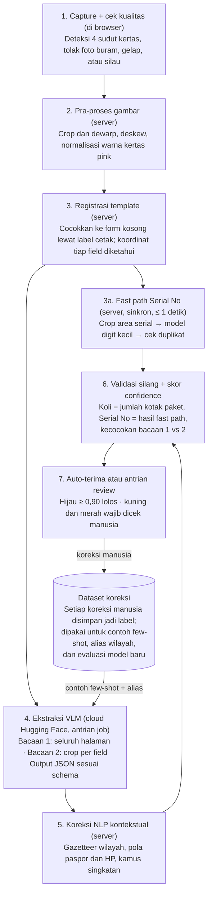
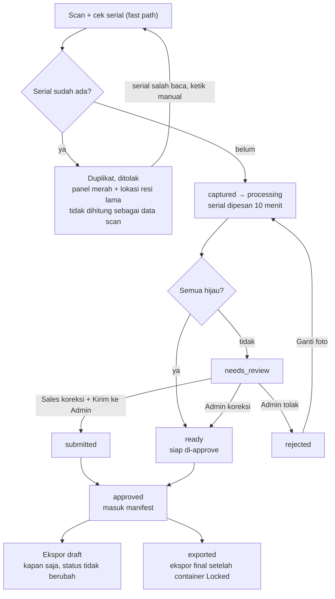
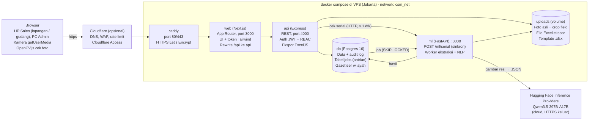
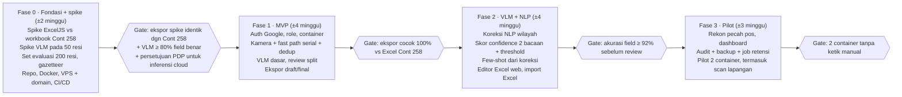

# PRD — Container Management System (Internal) · v2

v1: 28 Sep 2026 · @azura — v2: 29 Sep 2026 (revisi hasil review & brainstorming)

## Daftar isi

0. [Perubahan dari v1](#0-perubahan-dari-v1)
1. [Ringkasan](#1-ringkasan)
2. [Tujuan, non-goals, dan metrik](#2-tujuan-non-goals-dan-metrik)
3. [User roles dan permission](#3-user-roles-dan-permission)
4. [Dokumen sumber dan pemetaan ke template Excel](#4-dokumen-sumber-dan-pemetaan-ke-template-excel)
5. [Fitur dan user stories](#5-fitur-dan-user-stories)
6. [Pipeline Computer Vision: VLM + NLP](#6-pipeline-computer-vision-vlm--nlp)
7. [User flow utama](#7-user-flow-utama)
8. [Design system](#8-design-system)
9. [Arsitektur teknis](#9-arsitektur-teknis)
10. [Skema database](#10-skema-database)
11. [API endpoints](#11-api-endpoints-express-prefix-apiv1)
12. [Non-functional requirements](#12-non-functional-requirements)
13. [Roadmap, risiko, dan open questions](#13-roadmap-risiko-dan-open-questions)

## 0. Perubahan dari v1

v2 memperbaiki 10 kontradiksi di v1 dan mencatat 6 keputusan baru: baca tulisan tangan memakai model open-source terakurat dari Hugging Face yang dijalankan di cloud, website di-deploy online ke VPS (MacBook Pro M5 hanya untuk pengembangan), Sales juga scan di lapangan, fitur offline dihapus, Serial No tetap satu urutan untuk kedua merek form, dan foto resi serta data pribadi hanya disimpan sampai 30 hari setelah container Closed.

**Keputusan baru**

| Keputusan | Pilihan | Konsekuensi |
| --- | --- | --- |
| Mesin baca tulisan tangan | VLM open-source dengan skor OCR tertinggi di Hugging Face, **Qwen3.5-397B-A17B** (Apache-2.0), dipanggil lewat Hugging Face Inference Providers (cloud); bukan pipeline TrOCR kustom | Tidak butuh GPU sendiri; tidak perlu 1.000 label sebelum go-live; foto resi (berisi paspor & HP) dikirim ke penyedia inferensi pihak ketiga, jadi perlu persetujuan manajemen soal UU PDP |
| Host | Website, API, database, dan service `ml` di-deploy online ke VPS region Jakarta; MacBook Pro M5 (24 GB / 1 TB) hanya untuk pengembangan | VPS tidak perlu GPU karena VLM di cloud; tidak ada server di kantor yang harus dirawat |
| Lokasi scan | Gudang **dan** lapangan (rumah pengirim) | Website online di domain HTTPS publik, bisa diakses dari gudang maupun data seluler |
| Akses offline | **Dihapus** dari scope, tidak ada di roadmap | Aplikasi selalu butuh internet; tanpa sinyal Sales tidak bisa scan. Tidak ada service worker, cache offline, atau antrian lokal |
| Serial No kedua merek form | Satu urutan nomor | `UNIQUE (serial_no)` tetap cukup |
| Retensi foto & data pribadi | 30 hari setelah container berstatus Closed: foto dihapus, data pribadi (nama, alamat, paspor, HP) dianonimkan di semua tempat, termasuk ekspor lama dan audit log. Serial No, PCS, Kg, kota tujuan, dan hash foto tetap disimpan | Data pribadi disimpan sesingkat mungkin (UU PDP), tapi tetap tersedia sebagai bukti sampai rekonsiliasi pecah pos selesai |

**Kontradiksi v1 yang diperbaiki**

| # | Bagian | Masalah di v1 | Perbaikan di v2 |
| --- | --- | --- | --- |
| 1 | F7, §11 | Resi ditolak diminta "scan ulang", padahal Serial No unik selamanya sehingga scan ulang pasti diblokir | Scan ulang = **Ganti foto** pada resi yang sama (`POST /receipts/:id/replace-image`), bukan baris baru |
| 2 | F7 | OCR cepat salah baca serial → resi sah diblokir sebagai duplikat; serial typo yang dihapus mengunci serial asli selamanya | Aksi "Serial salah baca, ketik manual" di panel duplikat; aksi Super Admin "Bebaskan serial" (wajib alasan, masuk audit) |
| 3 | §3, §9, US-01 | Sales scan di rumah pengirim, tapi server hanya bisa dijangkau lewat Wi-Fi kantor | Website di-deploy online ke VPS dengan domain HTTPS publik; tidak perlu DNS internal |
| 4 | §6, §9 | Cek serial ±1 detik tidak mungkin lewat antrian job; pg-boss adalah library Node sehingga worker Python harus meniru protokolnya | Endpoint sinkron `POST /ml/serial`; antrian job memakai tabel `jobs` + `SELECT … FOR UPDATE SKIP LOCKED` |
| 5 | §3, §11 | Aturan login bilang hanya Super Admin yang mendaftarkan user, matriks bilang Admin juga; ada endpoint `/users` dan `/admin/users` yang tumpang tindih | Super Admin dan Admin boleh mendaftarkan user (Admin tidak bisa menyentuh akun/role Super Admin); satu endpoint `/admin/users` |
| 6 | F5, §7 | Flow bilang ekspor hanya setelah lock, fitur lain menyiratkan ekspor kapan saja | Ekspor **draft** kapan saja; ekspor **final** hanya setelah container Locked |
| 7 | §10 | Enum status resi tidak punya status "dikirim ke Admin" dan "sudah diekspor"; hubungan `audited` vs `approved` tidak jelas | Enum baru dengan `submitted` dan `exported`; audit menjadi flag `audited_at`/`audited_by`, bukan status |
| 8 | F7 lapis 5, §10 | Paspor dan HP dienkripsi pgcrypto sehingga tidak bisa dibandingkan untuk deteksi isi mirip | Kolom *blind index* HMAC (`passport_bidx`, `recipient_phone_bidx`) |
| 9 | §10 | "16 tabel" tidak cocok: tabel `roles`, `sales_region`, import batch, whitelist, reservasi serial, row lock, threshold, versi model disebut tapi tidak ada; DDL `receipts` kurang kolom | Skema dilengkapi menjadi 24 tabel; DDL `receipts` lengkap |
| 10 | §3 | Admin melihat audit log "container sendiri", padahal container tidak punya pemilik | Admin melihat audit log semua container, kecuali aksi pada akun Super Admin |

**Risiko yang ditambahkan:** ExcelJS merusak pivot/merge pada template asli, VLM "mengarang" isi field kosong, data pribadi dikirim ke penyedia inferensi cloud, layanan Hugging Face lambat atau mati, dan VPS down (lihat §13).

## 1. Ringkasan

Kami membangun web app internal (nama kerja: **CSM**) yang mengubah foto resi tulisan tangan menjadi baris Excel siap pakai, dengan target input 1 resi turun dari ±3 menit ketik manual menjadi <40 detik scan + review.

**Masalah hari ini.** Setiap container (contoh: Cont 257, Cont 258 / TXGU 7181980) berisi ratusan resi kertas "Jakarta Cargo Express / Sahara" yang diisi tangan dengan huruf kapital, sering miring, tertimpa garis, dan dipindai berwarna pink/putih. Admin mengetik ulang setiap resi ke workbook Excel multi-sheet, lalu merekonsiliasi PCS dan Kg per sales secara manual.

**Bukti dari file contoh:**

- PDF "Mr. Said Cont 257" = 22 halaman scan resi, tanpa text layer (100% gambar), jadi wajib dibaca mesin (OCR tulisan tangan).
- Workbook Container 258 berisi 15 sheet: 9 sheet `Laporan Loading-xxx`, 1 sheet `Data Laut Container-258` (manifest), pivot per sales, dan sheet rekonsiliasi `Loading VS Pecah Pos` (700 baris).
- Typo sudah masuk ke data final, misalnya "Tlung Agung" (Tulungagung) dan "Rr.16/06" (Rt.16/06). Ini persis jenis kesalahan yang harus ditangkap koreksi kontekstual NLP.

**Solusi singkat.** Kamera (HP atau webcam, di gudang maupun di rumah pengirim) memotret resi → model vision-language (VLM) open-source dari Hugging Face yang dijalankan di cloud membaca seluruh form menjadi field terstruktur → lapisan NLP mengoreksi teks berdasarkan konteks (nama wilayah Indonesia, format paspor, format nomor HP, tipe paket) → Admin/Sales me-review field dengan confidence rendah → data dimasukkan ke template Excel yang disediakan, kolom demi kolom, tanpa merusak formula yang sudah ada.

## 2. Tujuan, non-goals, dan metrik

Rilis pertama sukses jika satu container penuh (±210 resi seperti Container 258) bisa diproses dari scan sampai file Excel final dalam satu hari kerja oleh 2 orang.

**Tujuan**

1. Menghapus pengetikan ulang resi: semua field resi terisi otomatis dari foto.
2. Menjaga akurasi data manifest yang dikirim ke pihak pelayaran dan pecah pos.
3. Mengisi template Excel perusahaan apa adanya (header, merge cell, formula `SUM`, `PROPER`, `VLOOKUP` tetap jalan).
4. Memberi visibilitas per container dan per sales: jumlah invoice, PCS, Kg, dan selisih loading vs pecah pos.

**Non-goals (rilis 1)**

- Bukan sistem akuntansi atau penagihan; kolom Insurance/Packing/VAT/Grand Total hanya disimpan, tidak dihitung ulang.
- Tidak ada tracking kapal real-time (AIS) atau integrasi API pelayaran.
- Tidak ada aplikasi mobile native; kamera diakses lewat browser biasa.
- Tidak ada portal untuk pelanggan/pengirim.
- Tidak ada akses offline, baik sekarang maupun di roadmap: tidak ada service worker, cache offline, atau antrian foto di perangkat. Semua fitur, termasuk scan, butuh koneksi internet.
- Tidak memakai model AI tertutup (proprietary). Resi dibaca oleh model open-weight dari Hugging Face yang dijalankan lewat layanan inferensi cloud.

**Metrik keberhasilan**

| Metrik | Baseline (manual) | Target rilis 1 | Cara ukur |
| --- | --- | --- | --- |
| Waktu per resi (scan → baris tersimpan) | ±3 menit (estimasi, perlu diukur) | < 40 detik | timestamp `scan_created` → `row_approved` |
| Akurasi field setelah VLM + NLP, sebelum review | – | ≥ 92% field benar | sampel 200 resi berlabel |
| Akurasi field numerik (Serial No, Pcs, Kg) | – | ≥ 98% | sampel yang sama |
| Field yang perlu dikoreksi manusia | 100% diketik | ≤ 15% field | log koreksi di layar review |
| Selisih PCS loading vs pecah pos | dicek manual | 100% terdeteksi otomatis | laporan rekonsiliasi |
| File Excel lolos dibuka tanpa error formula | – | 100% | uji ekspor otomatis |

## 3. User roles dan permission

Ada tiga role; Sales hanya melihat dan mengedit resi miliknya sendiri, Admin mengelola container, Super Admin mengelola sistem.

| Role | Siapa | Tanggung jawab utama |
| --- | --- | --- |
| Super Admin | Pemilik / IT internal | Kelola user & role, template Excel, master data (sales, wilayah, tipe paket), konfigurasi threshold model, bebaskan serial, audit log |
| Admin | Staf operasional gudang Surabaya | Kelola seluruh user (Admin & Sales), pantau jumlah data scan unik, buat container, scan, review & approve resi, lock container, ekspor Excel, rekonsiliasi pecah pos |
| Sales | Mr. Said, Mr. Mustofa, Mr. Salman, dst. | Scan resi miliknya di lapangan, perbaiki hasil scan, lihat rekap PCS/Kg miliknya per container |

**Matriks permission** (✓ = boleh, "milik sendiri" = hanya record dengan `sales_id` = user tsb)

| Aksi | Super Admin | Admin | Sales |
| --- | --- | --- | --- |
| Login dengan akun Google | ✓ | ✓ | ✓ |
| Daftarkan user (email Google + role), nonaktifkan | ✓ | ✓ semua user, kecuali akun Super Admin dan memberi role Super Admin | – |
| Kelola template Excel & mapping kolom | ✓ | – | – |
| Kelola master data (sales, wilayah, paket) | ✓ | ✓ (tambah alias wilayah) | – |
| Atur threshold confidence & versi model | ✓ | – | – |
| Buat / edit container | ✓ | ✓ | – |
| Scan resi (kamera / upload) | ✓ | ✓ | ✓ milik sendiri |
| Ganti foto resi (scan ulang resi yang ditolak/buram) | ✓ | ✓ | ✓ milik sendiri, sebelum approve |
| Review & koreksi field | ✓ | ✓ semua | ✓ milik sendiri, sebelum approve |
| Approve resi masuk manifest | ✓ | ✓ | – |
| Pindah resi antar container (Plus 1 / carry-over) | ✓ | ✓ | – |
| Lock / unlock container | ✓ | ✓ lock saja | – |
| Review & edit Excel container langsung di web | ✓ | ✓ | – |
| Ekspor Excel draft (kapan saja) | ✓ | ✓ | ✓ rekap milik sendiri |
| Ekspor Excel final (container Locked) | ✓ | ✓ | – |
| Lihat data paspor & nomor HP lengkap | ✓ | ✓ | ✓ milik sendiri; lainnya disamarkan |
| Lihat audit log | ✓ | ✓ semua container, kecuali aksi pada akun Super Admin | – |
| Hapus data (soft delete) | ✓ | – | – |
| Bebaskan Serial No dari resi terhapus | ✓ | – | – |

### Aturan login: wajib akun Google (OAuth 2.0 / OpenID Connect)

Satu-satunya cara masuk adalah tombol "Masuk dengan Google"; tidak ada form email/password, tidak ada daftar mandiri, dan role tidak pernah diambil dari Google.

1. **Hanya Google.** Halaman login hanya berisi satu tombol "Masuk dengan Google". Tidak ada password yang disimpan di database aplikasi.
2. **Harus didaftarkan dulu.** Super Admin atau Admin mendaftarkan email Google + role + display_name ("Mr. Said") sebelum user bisa masuk. Admin hanya bisa memberi role Admin atau Sales. Email Google yang belum terdaftar ditolak dengan pesan "Akun belum terdaftar. Hubungi Admin."
3. **Batasi domain.** Default hanya akun Google Workspace perusahaan (klaim `hd` = domain di `ALLOWED_GOOGLE_DOMAINS`). Akun Gmail pribadi hanya diizinkan jika emailnya ada di tabel `email_whitelist` yang diisi Super Admin.
4. **Email wajib terverifikasi.** Klaim `email_verified` harus `true`.
5. **Ikat ke Google ID.** Saat login pertama, `sub` Google disimpan di `users.google_sub`. Login berikutnya dicocokkan lewat `sub`, bukan email, sehingga pergantian email di Google tidak membuka akses ke akun lain.
6. **Verifikasi di server.** Express memakai Authorization Code flow + PKCE dengan parameter `state` dan `nonce`. ID token diverifikasi dengan `google-auth-library`: tanda tangan (JWKS Google), `aud` = client ID, `iss` = `accounts.google.com`, `exp` belum lewat, `nonce` cocok.
7. **Scope minimal.** Hanya `openid email profile`. Access/refresh token Google tidak disimpan; setelah verifikasi, API menerbitkan sesi sendiri (JWT access 15 menit + refresh 7 hari, cookie httpOnly, Secure, SameSite=Lax).
8. **User nonaktif langsung keluar.** Menonaktifkan user mencabut semua refresh token; sesi aktif berakhir paling lambat 15 menit.
9. **2-Step Verification.** Diwajibkan lewat kebijakan Admin Console Google Workspace, bukan di aplikasi.
10. **Akses darurat.** Tidak ada akun lokal. Jika Google tidak bisa diakses, Super Admin memakai skrip CLI di server (`npm run admin:grant`) untuk memberi sesi sementara, dan setiap pemakaiannya tercatat di audit log.
11. **Tercatat.** Setiap login berhasil, login ditolak (beserta alasannya: tidak terdaftar, domain salah, nonaktif), dan logout masuk `audit_logs`.

**Alur singkat:** klik "Masuk dengan Google" → `GET /api/v1/auth/google` (API membuat state + PKCE, redirect ke Google) → user memilih akun → `GET /api/v1/auth/google/callback` (tukar code, verifikasi ID token, cek user terdaftar dan aktif) → set cookie sesi → redirect ke halaman sesuai role.

**Deploy online.** Website di-deploy ke VPS (lihat "Host VPS" di §9) dan diakses lewat subdomain perusahaan, mis. `csm.namaperusahaan.co.id`, sehingga Sales bisa memakainya dari gudang maupun dari rumah pengirim.

- Caddy di VPS mengurus sertifikat HTTPS (Let's Encrypt) otomatis.
- Karena domainnya publik dan HTTPS, redirect URI Google OAuth (`https://csm.namaperusahaan.co.id/api/v1/auth/google/callback`) dan kamera `getUserMedia` langsung jalan di HP, baik lewat Wi-Fi maupun data seluler.
- Lapisan tambahan (opsional, disarankan): domain di-proxy lewat Cloudflare untuk WAF dan rate limit, plus Cloudflare Access dengan kebijakan "email domain perusahaan + whitelist" sehingga halaman login pun tidak terlihat oleh orang luar.
- Untuk pengembangan di MacBook, redirect URI kedua `http://localhost:3000/...` didaftarkan di Google Console.
- Client ID dan secret disimpan di `.env` di VPS (`GOOGLE_CLIENT_ID`, `GOOGLE_CLIENT_SECRET`), tidak masuk repo.

**Perlu dikonfirmasi:** apakah semua Sales punya akun Google Workspace perusahaan, atau sebagian memakai Gmail pribadi (yang berarti whitelist per email)? (juga di open questions §13)

## 4. Dokumen sumber dan pemetaan ke template Excel

Satu resi = satu baris di `Laporan Loading-{no}` dan satu baris di `Data Laut Container-{no}`; sistem menulis nilai mentah, template yang menghitung sisanya.

**Resi sumber (form cetak, isi tulisan tangan).** Field yang terbaca: Tanggal, Serial No (angka cetak merah/hitam), Pengirim, No Paspor, No Telpon pengirim, Penerima, Alamat, No Telpon penerima, 7 kotak Paket (Koper, Karton, Hambal, Selimut, Drum, Kotak Besi, Karung), Koli/Total Pcs, Berat (Kg), Insurance, Packing, VAT, Grand Total, tanda tangan + nama/HP pengirim. Di pojok kanan atas ada catatan tangan admin: nama sales, nomor container, dan catatan "Plus 1".

**Pemetaan field → kolom**

| Field resi | Sheet `Laporan Loading-{no}` | Sheet `Data Laut Container-{no}` | Aturan |
| --- | --- | --- | --- |
| Serial No | B · Invoice | F · Serial No | Integer 4–5 digit; kunci unik per resi; satu urutan nomor untuk form Jakarta Cargo Express dan Sahara |
| Alamat → kota/kab | C · Tujuan | E · Kota Tujuan | Diturunkan NLP dari alamat (mis. "Kab. Pamekasan" → Pamekasan; provinsi jauh → singkatan: NTB, Kalsel, Sulteng) |
| Pengirim | – | B · Pengirim | Title case; pertahankan pola "Bt"/"Bin" |
| Penerima | – | C · Penerima | Boleh 2 nama dipisah "/" |
| Alamat | – | D · Alamat Lengkap | Dinormalisasi: Kp., Ds., Dsn., Kec., Kab., Rt.xx/xx |
| No Paspor | – | G · No Paspor | Pola `^[A-Z]{1,2}\d{6,7}$` (C8060823, XD671976, E2821585) |
| No Telpon (penerima) | – | H · No Telpon | Pola `^08\d{8,11}$`; beberapa nomor dipisah spasi |
| Koper | D · Tas | I · Tas | Integer ≥ 0 |
| Karton | E · Krt | J · Ktn | Integer ≥ 0 |
| Karung | F · Krg | K · Krg | Integer ≥ 0 |
| Hambal, Selimut, Drum, Kotak Besi | G · Lain2 | L · Lain2 | Dijumlah; rincian asli tetap disimpan di DB |
| Koli / Total Pcs | H · PCS (formula `SUM(D:G)`) | M · Pcs | Tidak ditulis; dipakai untuk validasi silang vs jumlah kotak paket |
| Berat | I · Kg | N · Kg | Angka; buang satuan "kg" |
| Nama sales | J · Ket. | P · Sales | Dari catatan pojok resi atau dari user yang scan; format "Mr. Nama" |
| Status cek | K · Cek | O · Keterangan | "C" saat approve; teks bebas untuk "Plus 1 (64627)" |
| – | A · No | A · NO | Nomor urut otomatis |

**Aturan menulis ke template**

- Kolom berisi formula (PCS, `PROPER`, `VLOOKUP` Region, referensi antar sheet) tidak pernah ditimpa; sistem hanya menulis sel input dan memperpanjang formula ke baris baru.
- Header container diisi dari data container: nomor container ("DATA LAUT CONTAINERS KE-258"), nomor box (TXGU 7181980), tanggal.
- Baris total (`SUM` PCS & Kg) digeser ke bawah baris data terakhir.
- Sheet pivot (`PVT Loading`) dan `Data Loading VS Pecah Pos` diregenerasi dari DB, bukan dari pivot Excel.
- Referensi eksternal `[1]Sheet1` di kolom Region diganti lookup ke tabel `sales_region` di DB, karena file eksternal tidak ikut ter-upload.

### Contoh nyata: resi Serial No 35616

Resi ini (tanggal 4/8/26, kertas pink) menghasilkan satu baris di tiap sheet. Bacaan di bawah adalah hasil yang diharapkan setelah VLM + NLP, dengan status confidence yang akan tampil di layar review.

| Field di kertas | Tulisan tangan | Nilai final | Sheet `Laporan Loading` | Sheet `Data Laut Container` | Status |
| --- | --- | --- | --- | --- | --- |
| Serial No | 35616 (cetak merah) | 35616 | B Invoice | F Serial No | Hijau; kunci unik, dicek duplikat |
| Pengirim | HANIPAH BT ADE | Hanipah Bt Ade | – | B Pengirim | Kuning; nama tidak dikoreksi otomatis (Hanipah/Hanifah) |
| No Paspor | E - 4499 715 | E4499715 | – | G No Paspor | Kuning; huruf pertama E atau F perlu dicek |
| Penerima | IBU YAYAH | Ibu Yayah | – | C Penerima | Hijau |
| Alamat | KP-WANA SUKA CIWIDEY. RT-05/06. DS-SUGIH MUKTI. KEC-PASIR JAMBU. KAB-BANDUNG | Kp. Wanasuka Ciwidey Rt.05/06 Ds. Sugihmukti Kec. Pasirjambu Kab. Bandung | – | D Alamat Lengkap | Hijau; desa dan kecamatan cocok hierarki gazetteer |
| Tujuan (turunan alamat) | KAB-BANDUNG | Bandung | C Tujuan | E Kota Tujuan (formula) | Hijau |
| No Telpon penerima | 085524446728 / 085213038585 | 085524446728 085213038585 | – | H No Telpon | Hijau; dua nomor dipisah spasi seperti di template |
| Paket | Koper = 1 | Koper 1 | D Tas = 1 | I Tas = 1 | Hijau |
| Koli / Total Pcs | 1 - PCS | 1 | H PCS (formula = 1) | M Pcs | Hijau; cocok dengan jumlah kotak paket |
| Berat | 20 - Kg | 20 | I Kg | N Kg | Hijau |
| Sales | – (tidak tertulis di resi) | Mr. Said | J Ket. | P Sales | Diambil dari user yang scan atau pilihan sales saat mulai scan |
| Cek | – | C | K Cek | – | Terisi otomatis saat Admin approve |

**Disimpan di database tapi tidak ditulis ke Excel:** tanggal resi 4/8/26, Insurance 261, Packing 25, VAT kosong, Grand Total 286, nama dan HP pengirim di tanda tangan (Abhur, 0560356139). Validasi silang: 261 + 25 = 286 cocok dengan Grand Total, jadi angka biaya diterima tanpa review.

**Pengecekan duplikat untuk resi ini:** Serial No 35616 sudah tercatat di bundel Cont 257 (halaman terakhir PDF "Mr. Said Cont 257"), dan di sheet `Laporan Loading-258(A)` urutan serial melompat dari 35615 ke 35617. Jika resi ini di-scan lagi saat mengisi Container 258, sistem harus menolaknya sebagai data ganda dan menunjuk ke Container 257 (lihat F7).

## 5. Fitur dan user stories

Delapan modul membentuk rilis 1; scan langsung dari kamera adalah jalur utama, Import PDF adalah opsi bulk, dan tidak ada Serial No yang boleh masuk dua kali.

**F1. Scan kamera**

- Kamera via `getUserMedia` di HP (kamera belakang) dan webcam desktop; ini jalur utama: user langsung memotret kertas satu per satu tanpa mengirim file. Untuk bundel scan yang sudah ada, pakai Import PDF (F1b).
- Overlay bingkai A5 portrait; auto-capture saat 4 sudut kertas terdeteksi stabil 0,6 detik.
- Cek kualitas di klien sebelum upload: blur (Laplacian variance), terlalu gelap, silau. Tolak dengan pesan spesifik ("Foto buram, dekatkan 10 cm").
- Mode batch: scan beruntun tanpa keluar kamera; counter "23 resi · 4 menunggu diproses".
- Tidak ada mode offline. Saat koneksi putus, tombol shutter dinonaktifkan dan tampil pesan "Tidak ada koneksi internet. Scan butuh koneksi." Jika koneksi putus di tengah upload, foto itu tampil dengan tombol *Kirim ulang* selama layar kamera masih terbuka; foto tidak disimpan di perangkat.

**F1b. Import PDF (opsional, bulk)**

- Tombol "Import PDF" di halaman container, tersedia untuk semua role (Sales otomatis tercatat sebagai sales resi tsb).
- Menerima PDF hasil scanner seperti "Mr. Said Cont 257" (22 halaman, 39 MB) serta banyak JPG/PNG sekaligus. Batas: 100 MB dan 100 halaman per PDF.
- Tiap halaman dirasterisasi 300 dpi di server lalu masuk pipeline yang sama dengan scan kamera; satu halaman = satu resi.
- Sebelum import dijalankan, tampil ringkasan pra-import, mis. "22 halaman: 20 resi baru, 1 duplikat (35616 sudah di Container 257), 1 tidak terbaca". User memilih lanjut atau batal; duplikat tidak pernah ikut diimport.

**F2. Ekstraksi VLM + koreksi NLP** (detail di bagian 6)

- Setiap field punya nilai mentah (raw), nilai terkoreksi, confidence 0–1, dan alasan koreksi.
- Hasil muncul ≤ 12 detik per resi (p95), termasuk waktu panggilan ke layanan inferensi Hugging Face (lihat §6).

**F3. Review split-view**

- Kiri: foto resi dengan zoom; field aktif di-highlight di foto (bounding box).
- Kanan: form field dengan warna status: hijau (≥ 0,90), kuning (0,70–0,89), merah (< 0,70 atau gagal validasi).
- Keyboard-first: `Tab` lompat hanya ke field kuning/merah, `Enter` terima saran, `Ctrl+Enter` approve dan buka resi berikutnya.
- Saran NLP tampil sebagai chip: "Tlung Agung → Tulungagung (Kab., Jatim)" yang bisa diterima atau ditolak.
- Deteksi duplikat Serial No di container mana pun, dengan link ke resi yang bentrok.

**F4. Manajemen container**

- Container: nomor urut (258), nomor box (TXGU 7181980), tanggal, status (Draft → Loading → Locked → Shipped → Pecah Pos → Closed).
- Daftar resi per container dengan filter sales, tujuan, status review.
- Pindah resi antar container untuk kasus "Plus 1" / muatan tertinggal (sheet `(C)` vs `(A)` di template).

**F5. Ekspor Excel**

- Satu klik: generate workbook dari template aktif, satu file per container, nama `Container ({no}) {box} {yyyy} {Mon} {dd}.xlsx`.
- Dua mode ekspor:

| Mode | Kapan boleh | Isi | Efek ke status resi |
| --- | --- | --- | --- |
| Draft | Kapan saja (status Draft, Loading, Locked) | Semua resi approved saat itu; sheet `_meta` berisi `status=draft`; nama file berakhiran `-DRAFT` | Tidak mengubah status |
| Final | Hanya jika container Locked | Semua resi approved; sheet `_meta` berisi `status=final` | Resi yang ikut berubah ke `exported` |

- Ekspor per sales untuk Sales (rekap miliknya), selalu mode draft.
- Versi ekspor disimpan; bisa unduh ulang versi lama sampai batas retensi (30 hari setelah container Closed, lihat §12). Batang "Masuk Excel" di dashboard (F9b) hanya menghitung resi `exported`.

**F6. Rekonsiliasi dan dashboard**

- Tabel per sales: jumlah invoice, PCS, Kg (menggantikan `PVT Loading`).
- Input data pecah pos (upload Excel atau scan) lalu bandingkan PCS per invoice; baris dengan selisih ≠ 0 ditandai.

**F7. Deteksi data ganda (Serial No = kunci unik)**

Serial No yang tercetak di kertas adalah identitas resi. Satu Serial No hanya boleh ada satu kali di seluruh sistem, lintas semua container, termasuk container yang sudah Closed dan resi yang di-soft-delete.

| Lapisan | Kapan | Yang dicek | Tindakan |
| --- | --- | --- | --- |
| 1. Foto identik | Saat foto masuk | sha256 file sama | Ditolak otomatis, tidak diproses ML |
| 2. Foto mirip | Saat foto masuk | Perceptual hash (pHash), jarak Hamming ≤ 8 | Peringatan "foto mirip resi 35616", lanjut ke cek serial |
| 3. Serial No | ±1 detik setelah capture, OCR cepat khusus area Serial No | Serial sudah ada di tabel `receipts` | Diblokir, tidak ada baris baru dibuat (detail di bawah) |
| 4. Constraint database | Saat menyimpan | `UNIQUE (serial_no)` | Dua user scan serial yang sama bersamaan: yang kedua ditolak `409 SERIAL_DUPLICATE` |
| 5. Isi mirip | Setelah ekstraksi lengkap | Paspor + HP penerima + Kg sama di container yang sama, serial berbeda | Peringatan kuning "kemungkinan Serial No salah baca"; Admin memutuskan |

**Perilaku saat duplikat terdeteksi di kamera:** HP bergetar, bunyi berbeda dari bunyi sukses, dan muncul panel merah di viewfinder: "Serial No 35616 sudah di-scan · Container 257 · Mr. Said · oleh Admin Gudang, 4 Agu 2026 10:12". Panel juga menampilkan crop area Serial No dari foto baru supaya user bisa membandingkan angka dengan mata. Pilihan:

- *Buka resi lama*.
- *Ganti foto resi lama* (jika foto lama buram; lihat "Ganti foto" di bawah).
- *Serial salah baca* — user mengetik Serial No yang benar dari kertas; ketikan dicek duplikat ulang, dan jika lolos resi diproses normal. Kejadian ini dicatat di `scan_attempts` dengan result `serial_misread` sebagai data latih model serial.
- *Lewati*.

Mode batch langsung siap untuk kertas berikutnya.

**Ganti foto (pengganti "scan ulang").** Karena Serial No unik selamanya, resi yang ditolak (`rejected`) atau fotonya buram tidak pernah di-scan sebagai resi baru. User membuka resi tsb lalu menekan *Ganti foto*: foto baru disimpan sebagai `receipt_images` versi berikutnya (foto lama tetap disimpan sampai batas retensi, lihat §12), status kembali ke `processing`, dan ekstraksi dijalankan ulang. Serial No yang terbaca di foto baru harus sama dengan serial resi; jika beda, user diminta memilih.

**Reservasi serial.** Saat cek serial lolos (Skenario A langkah 3), Serial No dipesan di `serial_reservations` atas nama user tsb selama 10 menit. Jika foto tidak pernah terkirim atau ekstraksi gagal total, reservasi kedaluwarsa dan serial bisa dipakai lagi. User lain yang men-scan serial yang sedang dipesan melihat panel kuning "Serial 35616 sedang diproses oleh Mr. Said".

**Bebaskan serial (Super Admin).** Resi yang di-soft-delete tetap mengunci Serial No-nya. Jika resi itu ternyata salah ketik serial (mis. 35661 seharusnya 35616), Super Admin memakai aksi *Bebaskan serial*: wajib isi alasan, serial lama pada resi terhapus diganti penanda `NULL` + disimpan di kolom `released_serial_no`, dan seluruh aksi masuk `audit_logs`. Aksi ini tidak tersedia untuk resi yang belum dihapus.

**Aturan tambahan**

- Serial No wajib. Resi yang serialnya tidak terbaca tidak bisa disimpan sampai serial diketik manual, dan ketikan itu dicek duplikat ulang.
- Setiap koreksi Serial No di layar review atau editor Excel juga dicek ulang ke database.
- Resi yang pindah container (kasus "Plus 1") dipindahkan lewat fitur Pindah, bukan di-scan ulang.
- Setiap duplikat yang dicegah dicatat di `scan_attempts` dengan result `duplicate`. Catatan ini tidak pernah masuk `receipts` dan tidak dihitung sebagai data scan.

**F8. Halaman Admin**

*a. Kelola seluruh user.* Tabel semua user: nama, email Google, role, display name sales ("Mr. Said"), status, login terakhir, jumlah resi unik yang di-scan. Aksi: daftarkan email Google + role, ubah role Admin/Sales, nonaktifkan/aktifkan (langsung mencabut sesi), lepas ikatan akun Google. Baris akun Super Admin hanya bisa dilihat oleh Admin, tidak bisa diubah.

*b. Jumlah data scan (tanpa duplikat).* Angka utama adalah jumlah resi unik: jumlah Serial No berbeda di `receipts` yang tidak berstatus rejected dan tidak dihapus. Percobaan scan duplikat yang diblokir tampil sebagai angka terpisah dan tidak pernah ditambahkan ke total. Rincian per container, per sales, per hari, dan per status (perlu review, approved, sudah diekspor), dengan filter rentang tanggal. Sesuai design system, tampil sebagai tabel dengan baris total, bukan kartu angka besar.

| Container | Sales | Resi unik | Perlu review | Approved | Duplikat diblokir |
| --- | --- | --- | --- | --- | --- |
| 258 | Mr. Said | 37 | 2 | 35 | 1 |
| 258 | Mr. Mustofa | 21 | 0 | 21 | 0 |
| **Total** | | **58** | **2** | **56** | **1** |

*Angka pada tabel contoh adalah ilustrasi tampilan.*

*c. Review & edit Excel langsung di web.* Admin membuka container dan melihat workbook dengan sheet tab yang sama seperti template: `Laporan Loading-258(A)`, `Data Laut Container-258`, `PVT Loading`, `Data Loading VS Pecah Pos`.

- Sel input (Invoice, Tujuan, Tas/Krt/Krg/Lain2, Kg, Ket., Pengirim, Penerima, Alamat, Paspor, Telpon) bisa diedit inline seperti di Excel: ketik, `Enter`, copy-paste antar sel, undo/redo.
- Sel formula (PCS, Kota Tujuan, Region, baris total, pivot) dikunci dan dihitung ulang langsung saat sel input berubah.
- Validasi sama dengan layar review: Serial No unik, angka ≥ 0, pola paspor dan HP. Sel yang gagal validasi diberi warna `bad` dan tidak bisa disimpan.
- Klik baris membuka foto resi di panel samping, dengan field terkait di-highlight, supaya edit selalu bisa dicek ke kertas asli.
- Edit disimpan ke database (sumber kebenaran) dan dicatat per sel di audit log (nilai lama, nilai baru, siapa, kapan). File .xlsx dibuat ulang dari data terbaru saat ekspor, sehingga web dan file tidak pernah beda isi.
- Dua Admin membuka container yang sama: baris yang sedang diedit orang lain terkunci dan menampilkan nama pengeditnya.
- Tombol "Preview file" menampilkan hasil .xlsx yang akan diunduh (read-only) sebelum ekspor final.

*d. Audit data tidak valid & kurang valid.* Halaman "Audit" di menu Admin berisi dua tab: **Tidak valid** dan **Kurang valid**, masing-masing dengan jumlahnya, mis. "Tidak valid (57) · Kurang valid (131)". Kategorinya sama persis dengan donut Super Admin (F9a), jadi angka di kedua halaman selalu cocok.

| Tab | Isi | Urutan default |
| --- | --- | --- |
| Tidak valid | Resi dengan minimal satu field merah, gagal validasi, atau Serial No tak terbaca | Serial tak terbaca dulu, lalu jumlah field merah terbanyak |
| Kurang valid | Resi dengan field kuning (0,70–0,89) dan tanpa field merah | Confidence terendah dulu |

- Setiap baris menampilkan Serial No, container, sales, tanggal scan, dan chip field yang bermasalah (mis. `No Telpon · merah`, `Alamat · kuning`) beserta alasannya ("pola HP tidak cocok", "kecamatan tidak ada di Kab. Bandung").
- Klik baris membuka layar review split (F3) langsung di field bermasalah pertama. Foto resi di kiri dengan area field di-highlight, form di kanan. `Tab` hanya berpindah antar field kuning/merah.
- Mode audit massal: Admin bisa berjalan dari satu resi ke resi berikutnya dengan `Ctrl+Enter` (simpan + buka berikutnya) tanpa kembali ke daftar.
- Edit bisa juga dilakukan langsung di grid seperti editor Excel (F8c), dengan filter "hanya tidak/kurang valid" aktif. Validasi yang sama berlaku: Serial No unik, pola paspor/HP, Koli = jumlah paket.
- Setelah disimpan, resi keluar dari antrian dan diberi tanda **Sudah diaudit** (`audited_at`, `audited_by`), bukan status baru; resi tetap perlu di-approve jika belum. Kategori asli dari model tidak diubah, supaya donut akurasi tetap mengukur kualitas model.
- Setiap perubahan tercatat per field di `audit_logs` (nilai lama, nilai baru, alasan opsional), dan setiap koreksi masuk dataset latih (bagian 6).
- Filter: container, sales, rentang tanggal, field tertentu (mis. hanya masalah No Paspor), sumber (kamera / Import PDF / Import Excel).

*e. Ekspor template & import file Excel dari luar.*

**Ekspor template.** Tiga pilihan di tombol "Ekspor" halaman container:

| Pilihan | Hasil | Role |
| --- | --- | --- |
| Template kosong | File .xlsx dari template aktif: semua sheet, header, merge cell, formula, dan dropdown validasi, tanpa baris data. Dipakai untuk mengisi data di luar sistem | SA, A |
| Container terisi | Workbook lengkap container (sama dengan F5) | SA, A |
| Hanya data bermasalah | Baris Tidak valid + Kurang valid saja, dengan kolom tambahan `Masalah` dan `Confidence`, untuk dicek di luar sistem | SA, A |

Setiap file hasil ekspor diberi sheet tersembunyi `_meta` berisi ID template, versi template, ID container, dan waktu ekspor. Sheet ini dipakai untuk mengenali file saat diimport kembali.

**Import file Excel dari luar.** Admin dapat mengunggah .xlsx (template kosong yang sudah diisi di luar sistem, atau workbook lama) ke sebuah container. File diperiksa dalam dua tahap sebelum ada satu baris pun yang disimpan.

*Tahap 1 — validasi file (apakah ini template yang benar):*

1. Format: harus .xlsx atau .xlsm, maksimal 20 MB, tidak terenkripsi password, makro tidak dijalankan.
2. Kenali template: baca `_meta` jika ada. Jika tidak ada (file lama), cocokkan struktur ke template aktif.
3. Sheet wajib ada: `Laporan Loading-{no}` dan `Data Laut Container-{no}`. Nomor container di nama sheet harus sama dengan container tujuan import.
4. Header harus cocok per posisi kolom: `No, Invoice, Tujuan, JENIS PACKET (Tas, Krt, Krg, Lain2), PCS, Kg, Ket., Cek` di baris 1–2 sheet Loading, dan `NO, Pengirim, Penerima, Alamat Lengkap, …` di baris 19–20 sheet Data Laut.
5. Kolom formula (PCS, Kota Tujuan, Region) tidak boleh berisi nilai ketikan yang menimpa formula. Jika ada, file tetap bisa diimport tapi nilai tersebut diabaikan dan ditandai.

Jika tahap 1 gagal, import dihentikan dengan pesan spesifik, mis. "Sheet `Laporan Loading-258(A)` tidak ditemukan. File ini sepertinya untuk Container 257." atau "Kolom E seharusnya `Krt`, di file tertulis `Karton`. Unduh template kosong terbaru dari menu Ekspor."

*Tahap 2 — validasi isi per baris:*

| Cek | Aturan | Jika gagal |
| --- | --- | --- |
| Serial No | Wajib, integer, unik di file dan di seluruh database | Baris ditolak sebagai duplikat, ditunjukkan lokasi resi lama |
| Angka paket | Tas/Krt/Krg/Lain2 integer ≥ 0; PCS = jumlahnya | Baris ditandai tidak valid |
| Kg | Angka > 0 | Baris ditandai tidak valid |
| No Paspor, No Telpon | Pola bagian 4 | Baris ditandai kurang valid |
| Tujuan / Alamat | Dicocokkan ke gazetteer wilayah | Tidak cocok = kurang valid, dengan saran koreksi NLP |
| Sales (Ket.) | Harus nama sales yang terdaftar | Baris ditandai tidak valid |

Setelah dua tahap, Admin melihat pratinjau sebelum commit: "215 baris: 198 valid, 11 kurang valid, 3 tidak valid, 3 duplikat (dilewati)". Sel yang bermasalah diwarnai `neutral`/`bad` dan bisa diperbaiki langsung di pratinjau. Admin memilih "Import baris valid saja" atau "Import semua kecuali duplikat". Baris kurang/tidak valid yang ikut diimport langsung masuk antrian Audit (F8d) dengan sumber `excel_import`. Duplikat tidak pernah diimport.

File asli, hasil validasi, dan siapa yang mengimport disimpan di tabel `excel_imports`, sehingga import bisa dilacak dan dibatalkan dalam 24 jam jika container belum di-lock.

**F9. Dashboard per role**

Super Admin melihat seberapa akurat hasil scan lewat diagram lingkar. Admin melihat berapa resi yang di-scan dan berapa yang sudah masuk file Excel lewat diagram batang. Keduanya hanya menghitung resi unik: duplikat yang diblokir tidak pernah ikut.

*a. Dashboard Super Admin — akurasi hasil scan (diagram lingkar / donut).* Setiap resi diberi satu kategori dari hasil model **sebelum** dikoreksi manusia, jadi diagram ini mengukur kualitas VLM + NLP, bukan kualitas kerja reviewer.

| Kategori | Aturan | Warna (bagian 8) |
| --- | --- | --- |
| Valid | Semua field confidence ≥ 0,90 dan lolos semua validasi (pola paspor/HP, Koli = jumlah paket, Serial No terbaca) | `good` #C6EFCE / #006100 |
| Kurang valid | Minimal satu field kuning (0,70–0,89), tidak ada field merah | `neutral` #FFEB9C / #9C5700 |
| Tidak valid | Minimal satu field merah (< 0,70), gagal validasi, atau Serial No tidak terbaca | `bad` #FFC7CE / #9C0006 |

- Tengah donut: total resi unik yang dianalisis. Legenda di samping: jumlah dan persen per kategori, angka rata kanan dengan `tabular-nums`.
- Klik satu segmen membuka daftar resi di kategori itu, lengkap dengan field mana yang kuning/merah, supaya Super Admin tahu field apa yang paling sering gagal.
- Di bawah donut ada tabel "Field paling sering salah": nama field, jumlah kuning, jumlah merah, dan persen dikoreksi manusia. Tabel ini jadi dasar keputusan fine-tune model berikutnya.
- Filter: rentang tanggal (default 30 hari), container, sales, sumber (kamera / Import PDF), versi model. Filter versi model memperlihatkan apakah model baru lebih akurat dari model lama.
- Angka pendamping di atas donut: akurasi field terverifikasi, yaitu persen field yang tidak diubah manusia saat review, sebagai pembanding metrik di bagian 2.

```
Akurasi hasil scan · 1–30 Sep 2026 · semua container          [Filter ▾]

        ╭───────╮        Valid          412   68,7%
      ╱   600     ╲      Kurang valid   131   21,8%
      ╲ resi unik ╱      Tidak valid     57    9,5%
        ╰───────╯
                           Akurasi field terverifikasi: 94,1%

Field paling sering salah     Kuning   Merah   Dikoreksi
No Telpon                        88      21      17,4%
Alamat                           64      12      11,0%
No Paspor                        40       9       7,8%
```

*b. Dashboard Admin — di-scan vs masuk Excel (diagram batang).* Dua batang berdampingan per kelompok:

| Batang | Definisi | Warna |
| --- | --- | --- |
| Di-scan | Resi unik yang tersimpan di `receipts` (tidak termasuk duplikat, tidak termasuk rejected) | `green-400` #33C481 |
| Masuk Excel | Resi berstatus `exported`, yaitu sudah tertulis di ekspor final container (ekspor draft tidak dihitung) | `green-700` #185C37 |

- Pilihan pengelompokan: per hari (default 14 hari terakhir), per container, atau per sales.
- Selisih kedua batang adalah pekerjaan yang belum selesai. Selisih itu ditampilkan sebagai angka di atas pasangan batang, mis. "−12 belum masuk", dan diklik untuk membuka daftar resi yang masih perlu review atau menunggu approve.
- Nilai tertulis di ujung setiap batang; sumbu Y mulai dari 0; gridline tipis warna `grid`; tanpa gradient, bayangan, atau efek 3D.
- Di bawah grafik ada tabel dengan angka yang sama plus baris total, supaya angka bisa dibaca tanpa hover dan bisa disalin ke laporan.
- Sales tidak punya dashboard ini. Rekap miliknya tetap berupa tabel di halaman container (F6).

```
Di-scan vs masuk Excel · per container            [Per hari | Per container | Per sales]

 250 ┤        ██ 212
 200 ┤        ██ ▓▓ 198      ██ 150
 150 ┤        ██ ▓▓          ██ ▓▓ 138
 100 ┤  ██ 96 ██ ▓▓          ██ ▓▓
  50 ┤  ██ ▓▓ 96             ██ ▓▓
   0 └──257─────258──────────259────
        ██ Di-scan   ▓▓ Masuk Excel      258: −14 belum masuk · 259: −12
```

Angka pada wireframe di atas hanya ilustrasi tampilan.

*Implementasi.* Grafik memakai Recharts (`PieChart` dengan `innerRadius` untuk donut, `BarChart` untuk batang) dengan token warna dari bagian 8. Angka dihitung di API, bukan di browser, dan di-cache 60 detik. Kategori akurasi disimpan sekali di `extraction_runs.quality` saat model selesai (run pertama per resi, atau per versi model), sehingga donut tidak perlu menghitung ulang semua field.

**User stories utama**

| ID | Sebagai | Saya ingin | Supaya | Kriteria terima |
| --- | --- | --- | --- | --- |
| US-01 | Sales | memotret resi di rumah pengirim | data masuk tanpa saya ketik | foto terkirim, status "Diproses" muncul ≤ 2 detik setelah capture |
| US-02 | Sales | melihat dan membetulkan hasil baca resi saya | resi saya benar sebelum dicek admin | field merah wajib diisi sebelum "Kirim ke Admin" |
| US-03 | Admin | upload PDF 22 halaman sekaligus | satu bundel sales diproses sekali jalan | 22 resi terbentuk, urut sesuai halaman |
| US-04 | Admin | hanya melompati field yang ragu | review cepat | rata-rata review ≤ 25 detik per resi |
| US-05 | Admin | mengekspor container ke template perusahaan | file langsung dikirim | file terbuka di Excel tanpa error, formula total cocok dengan DB |
| US-06 | Admin | melihat selisih loading vs pecah pos | barang hilang/tertukar ketahuan | semua invoice dengan selisih tampil di atas |
| US-07 | Super Admin | mengganti template Excel dan memetakan kolom | format baru tidak perlu ubah kode | mapping disimpan per versi template |
| US-08 | Super Admin | menambah alias wilayah | koreksi NLP makin tepat | alias langsung dipakai pada scan berikutnya |

## 6. Pipeline Computer Vision: VLM + NLP

Satu model vision-language (VLM) open-source dari Hugging Face, dijalankan di cloud, membaca seluruh form menjadi JSON terstruktur, lalu NLP di server sendiri memperbaiki hasilnya dengan konteks form yang sudah pasti: field alamat pasti berisi wilayah Indonesia, field paspor pasti berpola huruf+angka, field Kg pasti angka.

VLM menggantikan pipeline TrOCR + CRNN kustom di v1 karena tidak butuh 1.000 label sebelum go-live dan satu model menangani teks, angka, serta kotak paket sekaligus. Model dijalankan di cloud Hugging Face karena model open-source dengan akurasi tertinggi berukuran ratusan miliar parameter; menyewa GPU sendiri untuk model sebesar itu jauh lebih mahal daripada bayar per request, dan VPS aplikasi tidak perlu GPU.



**Pemilihan model.** Dipilih model open-weight dengan skor OCR/dokumen tertinggi yang tersedia di Hugging Face per September 2026:

| Model | Lisensi | OCRBench | OmniDocBench 1.5 | CC-OCR | Peran |
| --- | --- | --- | --- | --- | --- |
| **Qwen3.5-397B-A17B** | Apache-2.0 | 93,1 | 90,8 | 82,0 | Model utama |
| Qwen3.6-27B | Apache-2.0 | – | – | – | Pembanding di spike Fase 0 (lebih cepat & murah); cadangan jika model utama tidak tersedia |

Angka dari model card Qwen di Hugging Face. Tidak ada benchmark publik khusus tulisan tangan kapital Indonesia, jadi keputusan final diambil dari spike Fase 0 pada 50 resi nyata: model dengan akurasi field numerik tertinggi menang, waktu p95 sebagai pemecah seri.

**Komponen**

| Tahap | Pilihan | Alasan |
| --- | --- | --- |
| Deteksi kertas | OpenCV.js (contour + perspective transform) di browser | Umpan balik instan sebelum upload |
| Registrasi template | ORB feature matching ke scan form kosong (satu template per merek form); koordinat field tetap; jalan di VPS | Dipakai untuk crop Serial No, crop per field, dan bbox highlight di layar review |
| Fast path Serial No | Model digit kecil (PaddleOCR recognizer, charset `0-9`) di CPU VPS, endpoint sinkron `POST /ml/serial` | Cek duplikat ±1 detik tidak boleh bergantung pada panggilan cloud |
| Ekstraksi field | Qwen3.5-397B-A17B lewat **Hugging Face Inference Providers** (endpoint OpenAI-compatible `router.huggingface.co/v1`), `response_format` JSON schema | Akurasi OCR tertinggi di antara model open-weight; tanpa GPU sendiri |
| Prompt | Daftar field + deskripsi + aturan "tulis `null` jika kotak kosong, jangan menebak" + 3–5 contoh few-shot dari resi yang sudah dikoreksi | Menekan halusinasi pada field kosong; contoh few-shot menyesuaikan model dengan gaya tulisan resi tanpa fine-tune |
| Koreksi wilayah | Gazetteer Kemendagri (provinsi → kab/kota → kecamatan → desa) + fuzzy match RapidFuzz (Jaro-Winkler), dibatasi hierarki | Kecamatan harus berada di kab yang terbaca |
| Koreksi nama & teks bebas | Kamus singkatan (Kp., Ds., Dsn., Kec., Kab., Rt., Rw., Bt, Bin); nama orang tidak pernah dikoreksi otomatis | Nama Indonesia/Arab mudah "diperbaiki" jadi salah |
| Aturan format | Regex + normalisasi (O→0, I→1, S→5 hanya di field numerik) | Kesalahan baca klasik |
| Peningkatan model | Koreksi manusia → contoh few-shot dan alias wilayah baru; set evaluasi 200 resi dijalankan ulang setiap ada model open-source baru di Hugging Face; ganti model hanya jika skornya lebih tinggi | Model 397B tidak praktis di-fine-tune sendiri; model terbuka baru rutin muncul |

**Contoh koreksi kontekstual**

| Field | Hasil VLM mentah | Setelah NLP | Dasar koreksi |
| --- | --- | --- | --- |
| Alamat | KAB-PARLEKASAN | Kab. Pamekasan | Gazetteer, jarak edit 2, konsisten dengan kec. Batumarmar |
| Alamat | Kab. Tlung Agung | Kab. Tulungagung | Gazetteer kab/kota Jatim |
| Alamat | Rr.16/06 | Rt.16/06 | Pola RT/RW |
| No Paspor | C-8060823 | C8060823 | Pola paspor, buang tanda baca |
| No Telpon | O81249345417 | 081249345417 | Field numerik: O → 0 |
| Berat | 145 - Kg | 145 | Ambil angka, buang satuan |
| Koli | 2 - PCS | 2 | Cocok dengan kotak Drum = 2 |

**Skor confidence per field.** VLM tidak memberi confidence per field, dan tidak semua penyedia inferensi mengembalikan logprobs, jadi `c_vlm` dihitung dari kecocokan dua bacaan:

1. Bacaan 1: seluruh halaman → JSON semua field.
2. Bacaan 2: crop tiap field (koordinat dari registrasi template) dikirim dalam satu request → JSON yang sama.

| Hasil perbandingan (setelah normalisasi spasi/tanda baca) | `c_vlm` |
| --- | --- |
| Identik | 0,95 |
| Beda kecil (jarak edit ≤ 1 untuk teks, tidak berlaku untuk field numerik) | 0,80 |
| Beda | 0,60 |
| Salah satu `null` | 0,50 |

Jika penyedia mengembalikan logprobs, `c_vlm` dikalikan rata-rata probabilitas token field tsb. Untuk Serial No, bacaan VLM juga dibandingkan dengan hasil fast path; jika beda, field Serial No langsung merah.

Skor akhir diambil dari nilai terendah antara VLM dan NLP, lalu dipotong setengah bila validasi gagal:

```latex
c_{field} = \min(c_{vlm},\ c_{nlp}) \times \begin{cases} 1 & \text{validasi lolos} \\ 0.5 & \text{validasi gagal} \end{cases}
```

NLP tidak pernah menimpa diam-diam: nilai mentah, nilai saran, dan alasan selalu disimpan dan tampil di layar review. Threshold hijau/kuning/merah diatur Super Admin per field (tabel `field_thresholds`).

**Bounding box.** Highlight field di foto (layar review F3) memakai koordinat dari registrasi template, bukan dari VLM, karena koordinat VLM tidak cukup presisi.

**Data yang dikirim ke cloud.** Hanya gambar resi (halaman + crop field) dan prompt; tidak ada ID resi, nama sales, atau metadata lain. Token `HF_TOKEN` disimpan di `.env`. Penyedia inferensi dipilih yang menyatakan tidak menyimpan dan tidak melatih ulang dari data request; pilihan penyedia dikunci di konfigurasi, bukan dipilih otomatis oleh router. Jika manajemen mensyaratkan data tidak lewat penyedia bersama, opsi berikutnya adalah Hugging Face Inference Endpoints (dedicated, region dipilih sendiri) dengan biaya per jam yang jauh lebih tinggi.

**Biaya.** Dua bacaan per resi ≈ 2 gambar besar + ±1.500 token output. Biaya per resi dihitung di spike Fase 0 dari tarif penyedia yang dipilih dan dicatat per job di `extraction_runs`, supaya biaya per container terlihat.

**Data evaluasi awal.** 1.000 resi berlabel **tidak lagi menjadi syarat go-live**. Yang wajib hanya 200 resi berlabel sebagai set evaluasi tetap (sama dengan sampel metrik di bagian 2), dibuat semi-otomatis dengan mencocokkan Serial No scan lama ke baris Excel final Container 257/258. Label tambahan terkumpul sendiri dari koreksi di layar review.

## 7. User flow utama

Sales memotret di lapangan, Admin menyelesaikan di gudang; tidak ada resi yang masuk file Excel tanpa lewat tombol Approve.



**Status resi**

| Status | Arti | Masuk dari |
| --- | --- | --- |
| `captured` | Foto diterima, Serial No dipesan | Scan kamera, import PDF, import Excel |
| `processing` | Job ekstraksi berjalan | `captured`, atau Ganti foto dari `rejected` / `needs_review` |
| `needs_review` | Ada field kuning/merah | `processing` |
| `submitted` | Sales sudah memperbaiki field merah dan menekan "Kirim ke Admin" | `needs_review` |
| `ready` | Semua field hijau atau sudah dikoreksi Admin | `processing`, `needs_review` |
| `approved` | Disetujui Admin, masuk manifest | `ready`, `submitted` |
| `exported` | Sudah tertulis di ekspor final | `approved` |
| `rejected` | Ditolak Admin dengan alasan; menunggu Ganti foto | `needs_review`, `submitted`, `ready` |

Hasil audit (F8d) disimpan sebagai `audited_at` / `audited_by`, bukan status, sehingga resi yang sudah diaudit tetap harus di-approve. Mengedit resi `approved` di editor Excel (F8c) tidak mengubah statusnya; mengedit resi `exported` mengembalikannya ke `approved` sampai ekspor final berikutnya.

**Skenario A — Scan langsung dari kertas (jalur utama, HP atau webcam)**

1. User login dengan Google, memilih container aktif (default: container berstatus Loading terbaru) dan sales (otomatis dirinya jika role Sales).
2. Tekan "Scan resi"; kamera terbuka dengan bingkai A5, foto diambil otomatis saat kertas stabil. Tidak ada file yang perlu dikirim.
3. ±1 detik kemudian sistem membaca Serial No (fast path) dan mengecek duplikat. Jika Serial No sudah ada, muncul panel merah dengan lokasi resi lama dan scan berhenti di situ, kecuali user memilih "Serial salah baca" (F7). Jika belum ada, Serial No dipesan 10 menit untuk resi ini.
   Tanpa koneksi internet, scan tidak bisa dilakukan (tidak ada mode offline).
4. Dalam ±12 detik semua field terisi; user melengkapi field merah (mis. nomor HP yang terpotong).
5. Sales menekan "Kirim ke Admin"; Admin menekan "Approve". Kamera tetap terbuka untuk kertas berikutnya.
6. Counter di layar menghitung resi unik yang berhasil di-scan sesi ini, terpisah dari jumlah duplikat yang diblokir.

**Skenario B — Import PDF bulk (opsional, bundel scan yang sudah ada)**

1. Admin membuka Container 258 → "Upload bundel" → memilih PDF 22 halaman dan sales "Mr. Said".
2. Sistem memecah per halaman, membaca semua Serial No, lalu menampilkan ringkasan pra-import (resi baru, duplikat, tidak terbaca). Setelah dikonfirmasi, hanya resi baru yang diproses paralel.
3. Admin membuka antrian review yang diurutkan dari confidence terendah; `Tab` hanya berhenti di field kuning/merah.
4. Admin approve; resi dengan Serial No duplikat ditahan dengan peringatan.
5. Selama loading, Admin boleh mengunduh ekspor draft kapan saja untuk dicek. Setelah semua resi approved, Admin lock container, lalu "Ekspor Excel" (final) dan mengunduh `Container (258) TXGU 7181980 2026 Aug 28.xlsx`.

**Skenario C — Rekonsiliasi pecah pos**

1. Setelah container tiba dan dipecah, Admin mengunggah data pecah pos (Excel atau scan).
2. Sistem membandingkan PCS per Serial No; selisih ≠ 0 tampil di atas dengan kolom Ket. untuk catatan.
3. Container ditutup (Closed) setelah semua selisih diberi keterangan.

**Siklus container:** Draft → Loading → Locked → Shipped → Pecah Pos → Closed. Resi hanya bisa ditambah pada status Draft dan Loading.

## 8. Design system

Aplikasi dirancang seperti workbook Excel yang bisa dipakai kerja, bukan dashboard SaaS: hijau Excel sebagai warna struktur, grid rapat sebagai layout utama, dan warna conditional formatting Excel sebagai bahasa status.

**Konsep layout.** Tiga elemen dipinjam langsung dari Excel karena user sudah hafal: (1) bar atas hijau, (2) *field bar* seperti formula bar yang menampilkan nilai mentah vs nilai terkoreksi field aktif, dan (3) *sheet tabs* di bawah layar untuk berpindah tampilan container: Loading · Manifest · Rekap Sales · Pecah Pos. Header grid menampilkan huruf kolom template (A, B, C…) supaya Admin tahu persis sel mana yang akan terisi.

```
┌─ CSM │ Container 258 · TXGU 7181980 │ Loading │ [Ekspor Excel] ──┐  bar hijau #185C37
├─ Serial 35589 │ Alamat │ raw: KAB-PARLEKASAN  →  Kab. Pamekasan [Terima]┤  field bar
├──────────────────────────┬───────────────────────────────────────────┤
│  foto resi (zoom, box     │  A   B        C         D   E   F   G   I    │
│  merah di field aktif)    │  No  Invoice  Tujuan    Tas Krt Krg L2  Kg   │
│                           │  1   35589    Pamekasan  .   .   .   2  145  │
│                           │  2   35590    [Cianjur?] .   2   .   .  48   │
│                           │  … baris total: 212 inv · 450 pcs · 16.050 kg│
├──────────────────────────┴───────────────────────────────────────────┤
└─ [Loading] [Manifest] [Rekap Sales] [Pecah Pos]                    sheet tabs ─┘
```

**Warna**

| Token | Hex | Dipakai untuk |
| --- | --- | --- |
| `green-800` | #0A4524 | Teks link, ikon aktif di atas putih |
| `green-700` | #185C37 | Bar atas, sidebar aktif, header grid terpilih |
| `green-600` | #107C41 | Tombol primer, focus ring, tab sheet aktif |
| `green-400` | #33C481 | Garis progres scan, indikator kamera siap |
| `green-50` | #E9F5EE | Baris terpilih, hover baris |
| `ink` | #1F1F1F | Teks utama |
| `ink-muted` | #5E5E5E | Label field, teks sekunder |
| `grid` | #D6D6D6 | Garis sel, border input |
| `canvas` | #F3F3F3 | Latar aplikasi di luar grid |
| `surface` | #FFFFFF | Grid, panel, form |
| `good` | fill #C6EFCE / teks #006100 | Confidence ≥ 0,90, status Approved |
| `neutral` | fill #FFEB9C / teks #9C5700 | Confidence 0,70–0,89, perlu cek |
| `bad` | fill #FFC7CE / teks #9C0006 | Confidence < 0,70, validasi gagal, selisih pecah pos |

Tiga warna status diambil dari gaya bawaan Excel "Good / Neutral / Bad", jadi Admin langsung paham tanpa legenda. Hijau hanya untuk struktur dan aksi primer; status "benar" memakai `good`, bukan `green-600`, agar dua makna tidak bercampur.

**Tipografi**

- Font: **Selawik** (open-source, metrik setara Segoe UI milik Office), fallback `"Segoe UI", system-ui, sans-serif`. Satu keluarga saja.
- Angka di grid selalu `font-variant-numeric: tabular-nums` dan rata kanan; teks rata kiri.
- Skala: 12 (meta sel) · 13 (isi grid) · 14 (body, form) · 16 semibold (judul panel) · 20 semibold (judul halaman). Tidak ada ukuran display besar.
- Sentence case di semua label dan tombol; tidak ada label ALL CAPS.

**Spasi, bentuk, elevasi**

- Grid 4 px: 4 · 8 · 12 · 16 · 24 · 32. Tinggi baris grid 32 px (mode rapat 28 px), input 32 px, tombol 32 px (36 px di mobile).
- Radius mengikuti hierarki: sel dan input 2 px, tombol 4 px, dialog 8 px.
- Satu level bayangan, hanya untuk lapisan yang melayang (menu, dialog, toast). Panel dan grid memakai border 1 px `grid`, tanpa bayangan.

**Komponen inti**

| Komponen | Perilaku kunci |
| --- | --- |
| App shell | Bar atas 44 px hijau; sidebar 232 px, bisa diciutkan ke 56 px ikon; sheet tabs 32 px di bawah |
| Data grid | TanStack Table + virtual scroll untuk 700+ baris; header huruf kolom template; kolom freeze No + Invoice; baris total menempel di bawah |
| Field bar | Nama field · nilai mentah VLM · saran NLP · alasan · tombol Terima / Tolak |
| Sel confidence | Latar `good`/`neutral`/`bad` penuh, bukan titik warna; tooltip skor |
| Viewfinder kamera | Layar penuh di mobile, bingkai A5, pesan kualitas satu baris di atas tombol shutter |
| Review split | 45/55 foto vs form di ≥ 1280 px; tumpuk vertikal di mobile dengan foto bisa diciutkan |
| Status pill | Teks + warna status; label kata kerja lampau: "Approved", "Perlu review" |
| Empty state | Satu kalimat arahan + satu tombol, mis. "Belum ada resi di container ini. Scan resi pertama." |

**Aturan anti-AI-slop** (dicek saat design review setiap layar)

1. Tidak ada gradient, glassmorphism, atau blob dekoratif. Latar datar `canvas` dan `surface`.
2. Dashboard bukan deretan kartu KPI identik dengan angka besar. Ringkasan tampil sebagai baris total grid dan tabel rekap per sales.
3. Tidak ada ilustrasi 3D atau emoji; ikon memakai Fluent UI System Icons 20 px (keluarga ikon Office).
4. Tidak ada eyebrow label kecil di atas judul, tidak ada panah "→" di akhir tombol, tidak ada satu kata ber-highlight di judul.
5. Animasi hanya untuk respons aksi user (buka menu, simpan, approve), durasi 120–160 ms; tidak ada animasi masuk per section.
6. Komponen library (Radix/shadcn) wajib memakai token di atas; tampilan default library tidak boleh lolos ke produksi.
7. Copy tombol menyebut hasilnya: "Approve resi", "Ekspor Excel", "Ganti foto"; bukan "Submit" atau "Lanjutkan".
8. Pesan error menjelaskan apa yang salah dan cara memperbaiki: "Serial No 35589 sudah ada di Container 257. Pindahkan atau tandai Plus 1."

**Aksesibilitas.** Kontras teks ≥ 4,5:1 (teks status memakai warna teks bawaan Excel yang lolos di atas fill-nya), focus ring 2 px `green-600` terlihat di semua elemen, semua aksi review bisa dilakukan tanpa mouse, `prefers-reduced-motion` dihormati.

## 9. Arsitektur teknis

Stack sesuai permintaan: Next.js (frontend), Express (backend), PostgreSQL (database), semuanya di docker compose di satu VPS online; ditambah service Python (OCR serial, pra-proses gambar, NLP, klien VLM) karena tidak praktis dijalankan di Node, Caddy sebagai pintu HTTPS, dan VLM yang dipanggil di cloud Hugging Face. Docker compose yang sama dipakai untuk pengembangan di MacBook.



Express adalah satu-satunya pintu ke database dari sisi user. ML service punya dua jalur: endpoint sinkron `POST /ml/serial` (jalan di CPU VPS, tanpa cloud) yang hanya dipanggil API untuk cek duplikat instan, dan worker yang mengambil job ekstraksi dari tabel `jobs`, memanggil VLM di Hugging Face, menjalankan NLP, lalu menulis hasil. Model bisa diganti lewat konfigurasi tanpa menyentuh API. Jika Hugging Face lambat atau mati, job dicoba ulang dengan backoff; foto dan cek serial tetap jalan, dan resi bisa diisi manual di layar review.

**Antrian job tanpa pg-boss.** v1 memakai pg-boss, tapi pg-boss adalah library Node sehingga worker Python harus meniru skema dan protokol internalnya. v2 memakai tabel `jobs` sederhana yang bisa dibaca kedua bahasa:

```sql
-- worker Python mengambil satu job
UPDATE jobs SET status = 'running', locked_at = now(), attempts = attempts + 1
WHERE id = (
  SELECT id FROM jobs
  WHERE status = 'queued' AND run_after <= now()
  ORDER BY priority, created_at
  FOR UPDATE SKIP LOCKED LIMIT 1
) RETURNING *;
```

API memberi tahu worker lewat `NOTIFY jobs_new`; worker juga polling tiap 2 detik sebagai cadangan. Job yang `running` lebih dari 5 menit dianggap macet dan dikembalikan ke `queued` (maksimal 3 percobaan, lalu `failed`).

**Pilihan per layer**

| Layer | Pilihan | Catatan |
| --- | --- | --- |
| Frontend | Next.js 15 (App Router), TypeScript, Tailwind CSS v4 dengan token dari bagian 8, Radix UI primitives, TanStack Table + TanStack Query, Recharts (donut dan diagram batang dashboard), React Hook Form + Zod | Web app biasa: tanpa service worker, tanpa cache offline |
| Backend | Node 22, Express 5, TypeScript, Zod validasi, Prisma ORM, Multer upload, ExcelJS untuk tulis template | Kecocokan ExcelJS dengan template asli dibuktikan dulu di spike Fase 0 (lihat §13) |
| Auth | Google OAuth 2.0 / OpenID Connect via google-auth-library (code flow + PKCE), lalu sesi sendiri: JWT access 15 menit + refresh token 7 hari di cookie httpOnly; tanpa password | RBAC middleware per route berdasarkan `users.role` (enum) |
| Database | PostgreSQL 16 + ekstensi `pg_trgm` (fuzzy search nama/alamat) dan `pgcrypto` | Satu DB untuk data, antrian (`jobs`), dan audit |
| Antrian job | Tabel `jobs` + `FOR UPDATE SKIP LOCKED` + `LISTEN/NOTIFY` | Tidak perlu Redis; bisa dibaca Node dan Python |
| ML service | Python 3.11, FastAPI, OpenCV, PaddleOCR recognizer (serial), RapidFuzz; `huggingface_hub` `InferenceClient` / klien OpenAI-compatible ke `router.huggingface.co/v1` | Akses internet keluar hanya ke domain Hugging Face |
| VLM | Qwen3.5-397B-A17B lewat Hugging Face Inference Providers, `response_format` JSON schema, penyedia dikunci di konfigurasi (`HF_PROVIDER`) | Tidak ada GPU lokal; timeout 30 detik, maksimal 3 percobaan per job |
| Akses luar | Caddy (reverse proxy + HTTPS otomatis); Cloudflare proxy opsional | Hanya Caddy yang membuka port; web, api, db, ml hanya di network internal |
| Host | VPS region Jakarta (produksi); MacBook Pro M5 dengan OrbStack/Docker Desktop (pengembangan) | Image dibangun multi-arch (`amd64` + `arm64`) agar sama di VPS dan MacBook; lihat "Host VPS" di bawah |
| Storage file | Docker volume `uploads` (nanti bisa pindah ke MinIO/S3) | Path file disimpan di DB, file tidak di DB |
| Test | Vitest, Supertest (API), Playwright (E2E kamera pakai video palsu), pytest (ML) | Uji ekspor Excel dibandingkan snapshot sel; uji akurasi model pada set evaluasi 200 resi |

**Struktur repo (monorepo npm workspaces)**

```
csm/
  apps/web        # Next.js
  apps/api        # Express
  services/ml     # FastAPI: serial OCR, worker ekstraksi, NLP
  packages/shared # tipe TS, schema Zod, konstanta role, JSON schema field resi
  infra/          # docker-compose.yml, .env.example, init.sql
```

**docker-compose (ringkas)**

```yaml
services:
  web:  { build: ./apps/web,  depends_on: [api] }
  api:  { build: ./apps/api,  depends_on: [db], volumes: ["uploads:/data/uploads"] }
  ml:   { build: ./services/ml, depends_on: [db], volumes: ["uploads:/data/uploads"],
          environment: ["HF_TOKEN=${HF_TOKEN}", "HF_MODEL=Qwen/Qwen3.5-397B-A17B", "HF_PROVIDER=${HF_PROVIDER}"] }
  db:   { image: postgres:16, volumes: ["pgdata:/var/lib/postgresql/data"] }
  caddy: { image: caddy:2, ports: ["80:80", "443:443"], depends_on: [web],
           volumes: ["./Caddyfile:/etc/caddy/Caddyfile", "caddy_data:/data"] }
volumes: { pgdata: {}, uploads: {}, caddy_data: {} }
```

Semua service memakai `restart: unless-stopped`. Hanya Caddy yang mempublikasikan port (80/443); saat pengembangan di MacBook, `web` dibuka di `localhost:3000` tanpa Caddy. Karena produksi memakai domain HTTPS, kamera `getUserMedia` jalan di semua HP tanpa sertifikat lokal.

**Host VPS.** Website, API, database, dan service `ml` di-deploy online ke satu VPS. MacBook Pro M5 (24 GB / 1 TB) hanya dipakai untuk pengembangan dan menjalankan docker compose yang sama secara lokal. Karena VLM di cloud Hugging Face, VPS tidak butuh GPU.

| Hal | Aturan |
| --- | --- |
| Spesifikasi awal | 4 vCPU, 8 GB RAM, SSD 160 GB, Ubuntu LTS; naik kelas jika CPU rata-rata > 70% |
| Region | Jakarta (data pribadi tetap tersimpan di Indonesia, latensi rendah ke HP Sales) |
| Jaringan | Firewall hanya membuka 80/443 (Caddy) dan SSH dengan key; login password SSH dimatikan |
| HTTPS | Caddy sebagai reverse proxy dengan sertifikat Let's Encrypt otomatis; Cloudflare di depan sebagai DNS + proxy + WAF (opsional, disarankan) |
| Update | Security update OS otomatis (`unattended-upgrades`); update besar di luar jam kerja |
| Disk | Foto ±1,5 MB × ±250 resi × 2 versi ≈ 0,75 GB per container; peringatan otomatis jika disk terpakai > 80%. Bisa dipindah ke object storage (S3-compatible) bila perlu |
| Backup | `pg_dump` harian (wajib) + sinkron volume `uploads` ke object storage di akun/penyedia terpisah, disimpan 30 hari, terenkripsi; ditambah snapshot VPS mingguan. Foto dan data pribadi yang sudah dihapus karena retensi otomatis hilang dari backup setelah 30 hari |
| Uji restore | Restore ke VPS baru tiap 3 bulan |
| Monitoring | Cek uptime domain publik tiap menit, notifikasi ke Super Admin |
| Deploy | Build image di CI, push ke registry, `docker compose pull && up -d` di VPS; migrasi Prisma dijalankan sebelum container baru aktif |

## 10. Skema database

24 tabel; `receipts` adalah pusatnya, dan setiap nilai hasil model disimpan terpisah di `extracted_fields` supaya nilai mentah, saran NLP, dan nilai final bisa diaudit dan dipakai sebagai data latih. Role user adalah enum di `users.role`, bukan tabel terpisah.

**Pengguna dan akses**

| Tabel | Kolom kunci | Relasi / catatan |
| --- | --- | --- |
| `users` | id, name, email (Google, unik), google_sub (unik, diisi saat login pertama), avatar_url, role (`super_admin` \| `admin` \| `sales`), display_name ("Mr. Said"), is_active, last_login_at | Sales = user dengan role sales; display_name ditulis ke kolom Ket. / Sales |
| `refresh_tokens` | id, user_id, token_hash, expires_at, revoked_at | Rotasi refresh token |
| `email_whitelist` | email, note, created_by, created_at | Akun Gmail pribadi yang boleh login di luar domain Workspace |

**Container dan resi**

| Tabel | Kolom kunci | Relasi / catatan |
| --- | --- | --- |
| `containers` | id, seq_no (258, unik), box_no ("TXGU 7181980"), loading_date, status, template_id, locked_at, closed_at, purge_at, purged_at, created_by | Status: draft, loading, locked, shipped, unloading, closed |
| `receipts` | lihat DDL di bawah | Satu resi = satu baris Excel |
| `receipt_packages` | receipt_id, package_type (koper, karton, hambal, selimut, drum, kotak_besi, karung), qty | Dipetakan ke Tas / Krt / Krg / Lain2 saat ekspor |
| `receipt_images` | id, receipt_id, version, file_path (NULL setelah dihapus), page_no, sha256 (unik), phash, width, height, blur_score, replaced_at, retain_for_eval, purged_at | Ganti foto menambah versi baru. File foto dihapus sesuai retensi (§12), tapi barisnya beserta sha256 dan pHash tetap ada untuk deteksi foto ganda |
| `serial_reservations` | serial_no (PK), user_id, container_id, expires_at | Pesanan serial 10 menit antara cek serial dan resi tersimpan |
| `scan_attempts` | lihat tabel detail di bawah | Semua percobaan scan, termasuk yang ditolak |
| `import_batches` | id, container_id, sales_id, file_path, sha256, page_count, status (`analyzing`, `preview`, `confirmed`, `cancelled`), summary (jsonb), created_by, created_at | Satu upload PDF / banyak foto (F1b) |
| `excel_imports` | lihat tabel detail di bawah | Import .xlsx dari luar (F8e) |

**Model dan ekstraksi**

| Tabel | Kolom kunci | Relasi / catatan |
| --- | --- | --- |
| `model_versions` | id (mis. `hf-qwen3.5-397b-a17b-2026.10a`), hf_model_id, provider, prompt_version, eval_accuracy, eval_numeric_accuracy, is_active, activated_by, activated_at | Hanya satu yang aktif; aktivasi oleh Super Admin setelah lolos set evaluasi |
| `extraction_runs` | id, receipt_id, image_id, model_version, status, quality (valid \| kurang_valid \| tidak_valid), input_tokens, output_tokens, cost_usd, started_at, finished_at, error | Satu resi bisa diproses ulang dengan model baru atau foto baru |
| `extracted_fields` | id, run_id, field_key, raw_text, suggested_text, final_text, conf_vlm, conf_nlp, conf_final, bbox (jsonb), reason, corrected_by, corrected_at | Sumber data latih; `final_text ≠ raw_text` = label koreksi |
| `field_thresholds` | field_key (PK), green_min (default 0,90), yellow_min (default 0,70), updated_by, updated_at | Diatur Super Admin per field |
| `jobs` | id, type (`extract-receipt`, `rasterize-pdf`, `generate-export`, `retention-purge`), payload (jsonb), status (`queued`, `running`, `done`, `failed`), priority, attempts, run_after, locked_at, last_error, created_at | Antrian untuk Node dan Python (§9) |

**Master data, template, dan operasional**

| Tabel | Kolom kunci | Relasi / catatan |
| --- | --- | --- |
| `wilayah` | code (kode Kemendagri), name, level (prov/kab/kec/desa), parent_code, short_name (NTB, Kalsel) | Diisi sekali dari data resmi, ±90 ribu baris |
| `wilayah_aliases` | alias, wilayah_code, created_by | Contoh: "Tlung Agung", "T. Agung" → Tulungagung |
| `sales_region` | sales_id, region, valid_from | Pengganti referensi eksternal `[1]Sheet1` untuk kolom Region |
| `excel_templates` | id, name, version, file_path, mapping (jsonb), is_active | Mapping field → sheet + kolom + aturan |
| `exports` | id, container_id, template_id, mode (`draft` \| `final`), file_path, row_count, total_pcs, total_kg, created_by, created_at | Riwayat file yang pernah diunduh |
| `row_locks` | container_id, receipt_id, user_id, expires_at | Kunci baris editor Excel web; lepas otomatis setelah 2 menit idle |
| `unloading_records` | id, container_id, serial_no, pcs, kg, source (excel/scan), note | Data pecah pos untuk rekonsiliasi |
| `audit_logs` | id, actor_id, action, entity, entity_id, before (jsonb), after (jsonb), reason, ip, created_at | Append-only, tidak bisa diedit dari aplikasi |

**Detail `scan_attempts`** — menyimpan setiap percobaan scan, termasuk yang ditolak, supaya jumlah data scan dan jumlah duplikat bisa dihitung terpisah.

| Kolom | Isi |
| --- | --- |
| id, user_id, container_id, created_at | Siapa, di container mana, kapan |
| source | `camera` atau `pdf_import` (+ `import_batch_id` dan nomor halaman untuk PDF) |
| serial_read | Serial No hasil fast path |
| serial_typed | Serial No yang diketik user bila memilih "Serial salah baca" |
| result | `accepted`, `duplicate`, `serial_misread`, `unreadable`, `rejected_quality` |
| duplicate_of_receipt_id | Resi lama yang bentrok (jika `duplicate`) |
| duplicate_layer | `sha256`, `phash`, `serial`, `db_constraint` |

Jumlah data scan untuk Admin dihitung dari `receipts` saja: `SELECT COUNT(DISTINCT serial_no) FROM receipts WHERE status <> 'rejected' AND deleted_at IS NULL`. Jumlah duplikat yang diblokir dihitung dari `scan_attempts WHERE result = 'duplicate'`. Edit sel dari editor Excel di web masuk `audit_logs` dengan `entity = 'receipt'`, nama field, nilai lama, dan nilai baru.

**Detail `excel_imports`** — menyimpan setiap file Excel dari luar yang diunggah (F8e).

| Kolom | Isi |
| --- | --- |
| id, container_id, created_by, created_at | Siapa mengimport ke container mana, kapan |
| file_path, sha256 | File asli; sha256 mencegah file yang sama diimport dua kali |
| template_id, template_version, detected_by | Template yang dikenali; `detected_by` = `meta_sheet` atau `structure_match` |
| status | `validating`, `invalid_file`, `preview`, `committed`, `rolled_back` |
| rows_total, rows_valid, rows_kurang_valid, rows_tidak_valid, rows_duplicate | Ringkasan hasil tahap 2 |
| errors (jsonb) | Daftar masalah per sheet/baris/kolom untuk pratinjau |
| committed_at, rolled_back_at | Batas batal 24 jam |

Resi hasil import menyimpan `receipts.excel_import_id`, sehingga filter sumber "Import Excel" di halaman Audit dan pembatalan import bisa menemukan barisnya.

**Contoh DDL inti**

```sql
CREATE TYPE receipt_status AS ENUM
  ('captured','processing','needs_review','submitted','ready','approved','exported','rejected');
CREATE TYPE receipt_source AS ENUM ('camera','pdf_import','excel_import');

CREATE TABLE receipts (
  id                   uuid PRIMARY KEY DEFAULT gen_random_uuid(),
  container_id         uuid NOT NULL REFERENCES containers(id),
  serial_no            integer UNIQUE,          -- NULL hanya setelah "Bebaskan serial"
  released_serial_no   integer,                 -- serial asli sebelum dibebaskan
  sales_id             uuid NOT NULL REFERENCES users(id),
  source               receipt_source NOT NULL,
  import_batch_id      uuid REFERENCES import_batches(id),
  excel_import_id      uuid REFERENCES excel_imports(id),
  receipt_date         date,
  sender_name          text,
  sender_phone         bytea,                   -- pgcrypto
  passport_no          bytea,                   -- pgcrypto; pola paspor divalidasi di API
  passport_bidx        bytea,                   -- HMAC-SHA256(passport_no, kunci terpisah) untuk dedup lapis 5
  recipient_name       text,
  address              text,
  recipient_phone      bytea,                   -- pgcrypto
  recipient_phone_bidx bytea,                   -- HMAC-SHA256 nomor HP pertama yang dinormalisasi
  dest_city            text,
  wilayah_code         text REFERENCES wilayah(code),
  koli_total           smallint,
  weight_kg            numeric(7,2),
  insurance            numeric(12,2),
  packing              numeric(12,2),
  vat                  numeric(12,2),
  grand_total          numeric(12,2),
  cek_note             text,
  status               receipt_status NOT NULL DEFAULT 'captured',
  reject_reason        text,
  carried_from_container_id uuid REFERENCES containers(id),
  submitted_at         timestamptz,
  audited_by           uuid REFERENCES users(id),
  audited_at           timestamptz,
  approved_by          uuid REFERENCES users(id),
  approved_at          timestamptz,
  anonymized_at        timestamptz,             -- kolom pribadi di-NULL-kan oleh job retensi
  deleted_at           timestamptz,
  created_at           timestamptz NOT NULL DEFAULT now(),
  CHECK (serial_no IS NOT NULL OR (deleted_at IS NOT NULL AND released_serial_no IS NOT NULL))
);
CREATE INDEX ON receipts (container_id, status);
CREATE INDEX ON receipts (container_id, passport_bidx, recipient_phone_bidx);
CREATE INDEX ON receipts USING gin (address gin_trgm_ops);
```

**Catatan data sensitif.** `passport_no`, `sender_phone`, dan `recipient_phone` dienkripsi di level kolom (pgcrypto) dan hanya didekripsi di API untuk role yang berhak (lihat matriks di bagian 3). Karena ciphertext tidak bisa dibandingkan, deteksi isi mirip (F7 lapis 5) memakai kolom *blind index* HMAC dengan kunci yang berbeda dari kunci enkripsi. Kedua kunci ada di `.env` dan tidak masuk repo.

## 11. API endpoints (Express, prefix `/api/v1`)

REST JSON dengan satu aturan: role diperiksa di middleware, kepemilikan data (resi milik Sales) diperiksa di query, bukan di UI.

| Method | Path | Role | Fungsi |
| --- | --- | --- | --- |
| GET | `/auth/google` | semua | Mulai login Google: buat state + PKCE, redirect ke Google. Callback di `/auth/google/callback` menukar code, memverifikasi ID token, mengecek user terdaftar dan aktif, lalu set cookie sesi |
| POST | `/auth/refresh` | semua | Rotasi token |
| POST | `/auth/logout` | semua | Cabut refresh token |
| GET | `/me` | semua | Profil + role + permission |
| GET / POST | `/containers` | SA, A (GET juga S) | Daftar / buat container |
| PATCH | `/containers/:id` | SA, A | Ubah data atau status (lock, shipped, closed) |
| GET | `/containers/:id/summary` | SA, A, S* | Total invoice, PCS, Kg per sales |
| POST | `/containers/:id/scans` | SA, A, S | Upload beberapa foto JPG/PNG sekaligus (bukan PDF; PDF lewat `/imports/pdf`), tiap foto lewat cek duplikat yang sama; buat resi status `captured` dan job ML |
| GET | `/containers/:id/receipts` | SA, A, S* | Daftar resi, filter status/sales/tujuan, paginasi cursor |
| GET | `/receipts/:id` | SA, A, S* | Detail resi + field + confidence + URL gambar bertanda tangan |
| PATCH | `/receipts/:id/fields` | SA, A, S* | Simpan koreksi field (tercatat di `extracted_fields`) |
| POST | `/receipts/:id/submit` | S | Kirim ke Admin (semua field merah sudah terisi) |
| POST | `/receipts/:id/approve` | SA, A | Approve; tolak jika Serial No duplikat |
| POST | `/receipts/:id/reject` | SA, A | Tolak dengan alasan; resi menunggu Ganti foto |
| POST | `/receipts/:id/replace-image` | SA, A, S* | Ganti foto resi yang ditolak/buram; simpan versi foto baru, status → `processing`, jalankan ulang ekstraksi |
| POST | `/receipts/:id/move` | SA, A | Pindah ke container lain (Plus 1 / carry-over) |
| POST | `/receipts/:id/reprocess` | SA, A | Jalankan ulang ML dengan model aktif |
| GET | `/receipts/events` | SA, A, S* | Server-Sent Events: progres proses ML |
| POST | `/containers/:id/exports?mode=draft\|final` | SA, A (S: draft, rekap miliknya) | Generate Excel dari template aktif; `final` ditolak `409 CONTAINER_NOT_LOCKED` jika container belum Locked |
| GET | `/exports/:id/download` | SA, A, S* | Unduh file (S hanya rekap miliknya) |
| POST | `/containers/:id/unloading` | SA, A | Upload data pecah pos |
| GET | `/containers/:id/reconciliation` | SA, A | Selisih PCS/Kg loading vs pecah pos |
| GET / POST | `/templates` | SA | Daftar / upload template .xlsx |
| PUT | `/templates/:id/mapping` | SA | Simpan mapping field → sheet/kolom |
| GET | `/wilayah/search?q=` | semua | Autocomplete wilayah (pg_trgm) |
| POST | `/wilayah/aliases` | SA, A | Tambah alias ejaan |
| GET | `/audit-logs` | SA, A (container sendiri) | Riwayat perubahan |

**Endpoint tambahan: scan langsung, duplikat, halaman Admin**

| Method | Path | Role | Fungsi |
| --- | --- | --- | --- |
| POST | `/receipts/check-serial` | SA, A, S | Kirim crop area Serial No; API memanggil `POST /ml/serial`, cek duplikat + reservasi, balas serial terbaca dan lokasi resi lama jika ada. Dengan body `{ "typed": 35618 }` dipakai untuk "Serial salah baca" |
| POST | `/containers/:id/scans/camera` | SA, A, S | Kirim 1 foto dari kamera; ditolak `409 SERIAL_DUPLICATE` jika serial sudah ada |
| POST | `/containers/:id/imports/pdf` | SA, A, S | Upload PDF bulk, kembalikan ringkasan pra-import (baru, duplikat, tak terbaca) |
| POST | `/imports/:batchId/confirm` | SA, A, S | Jalankan import hanya untuk resi baru |
| GET | `/admin/stats?from=&to=&container=&sales=` | SA, A | Jumlah resi unik, per status, per sales, per hari, dan jumlah duplikat diblokir |
| GET / POST / PATCH | `/admin/users` | SA, A | Satu-satunya endpoint kelola user: daftar, daftarkan (email Google + role), ubah role, nonaktifkan (mencabut semua sesi), lepas ikatan google_sub. Admin tidak bisa mengubah akun Super Admin atau memberi role Super Admin |
| GET / POST / DELETE | `/admin/email-whitelist` | SA | Kelola akun Gmail pribadi yang boleh login |
| POST | `/admin/serials/:no/release` | SA | Bebaskan Serial No dari resi yang sudah di-soft-delete; wajib `reason` |
| GET / PUT | `/admin/field-thresholds` | SA | Threshold hijau/kuning per field |
| GET / POST | `/admin/model-versions` | SA | Daftar versi model + skor evaluasi; aktifkan versi |
| GET | `/containers/:id/workbook` | SA, A | Data semua sheet untuk editor Excel di web (baris, kolom, sel terkunci) |
| PATCH | `/containers/:id/workbook/cells` | SA, A | Simpan edit sel (batch), validasi + cek Serial No unik, catat audit |
| POST | `/containers/:id/workbook/lock-row` | SA, A | Kunci baris saat sedang diedit (lepas otomatis setelah 2 menit idle) |
| GET | `/containers/:id/workbook/preview` | SA, A | Render .xlsx hasil ekspor untuk dicek sebelum diunduh |

**Endpoint dashboard (F9)**

| Method | Path | Role | Fungsi |
| --- | --- | --- | --- |
| GET | `/dashboard/accuracy?from=&to=&container=&sales=&source=&model=` | SA | Jumlah dan persen resi Valid / Kurang valid / Tidak valid, akurasi field terverifikasi, daftar field paling sering salah |
| GET | `/dashboard/accuracy/receipts?category=` | SA | Daftar resi di satu segmen donut |
| GET | `/dashboard/throughput?groupBy=day\|container\|sales&from=&to=` | SA, A | Per kelompok: jumlah resi unik di-scan, jumlah masuk Excel, selisih |

**Endpoint audit, ekspor template, dan import Excel (F8d, F8e)**

| Method | Path | Role | Fungsi |
| --- | --- | --- | --- |
| GET | `/audit/receipts?category=tidak_valid\|kurang_valid&field=&container=&sales=&source=` | SA, A | Antrian audit beserta field bermasalah dan alasannya |
| PATCH | `/audit/receipts/:id` | SA, A | Simpan perbaikan field, validasi ulang, isi `audited_at`/`audited_by` (status tidak berubah), catat audit log |
| GET | `/templates/active/download` | SA, A | Unduh template kosong (dengan sheet `_meta`) |
| GET | `/containers/:id/exports/problems` | SA, A | Unduh hanya baris tidak/kurang valid |
| POST | `/containers/:id/excel-imports` | SA, A | Upload .xlsx; jalankan validasi file (tahap 1) lalu isi (tahap 2) |
| GET | `/excel-imports/:id` | SA, A | Pratinjau: ringkasan, error per sel |
| PATCH | `/excel-imports/:id/rows` | SA, A | Perbaiki sel di pratinjau sebelum commit |
| POST | `/excel-imports/:id/commit` | SA, A | Simpan baris (mode: valid saja / semua kecuali duplikat) |
| POST | `/excel-imports/:id/rollback` | SA, A | Batalkan import dalam 24 jam jika container belum di-lock |

SA = Super Admin, A = Admin, S = Sales, S* = Sales hanya untuk resi dengan `sales_id` miliknya.

**Kontrak ML service (internal, tidak diekspos ke browser)**

```json
// POST /ml/serial (sinkron, dipanggil API)
{ "imagePath": "/data/uploads/tmp/8f1c.jpg", "formTemplate": "jce-v1" }
→ { "serial": "35616", "conf": 0.97, "bbox": [880, 40, 1010, 92] }

// baris di tabel jobs, type "extract-receipt"
{ "receiptId": "uuid", "imageId": "uuid", "imagePath": "/data/uploads/258/35589.jpg", "templateVersion": 3 }

// hasil yang ditulis worker
{ "receiptId": "uuid", "modelVersion": "hf-qwen3.5-397b-a17b-2026.10a",
  "fields": [ { "key": "address", "raw": "KAB-PARLEKASAN", "suggested": "Kab. Pamekasan",
               "confVlm": 0.71, "confNlp": 0.93, "confFinal": 0.71,
               "bbox": [212, 388, 640, 522], "reason": "gazetteer:kab, edit=2" } ] }
```

Format error seragam: `{ "error": { "code": "SERIAL_DUPLICATE", "message": "Serial No 35589 sudah ada di Container 257", "details": {...} } }`.

## 12. Non-functional requirements

Data resi berisi nomor paspor, alamat, dan nomor HP pekerja migran beserta keluarganya, jadi keamanan dan audit diperlakukan sebagai syarat rilis, bukan tambahan.

| Area | Requirement | Target |
| --- | --- | --- |
| Performa UI | Grid 700 baris scroll mulus (virtualisasi) | 60 fps, render awal < 1 detik |
| Performa ML | Waktu ekstraksi per resi (2 bacaan VLM di cloud + NLP), p95 | ≤ 12 detik |
| Cek serial | Capture → panel duplikat/lolos di kamera, p95 | ≤ 1,5 detik lewat 4G |
| Throughput | Bundel PDF 22 halaman selesai | ≤ 3 menit (4 request paralel ke Hugging Face) |
| Ekspor | Generate Excel 1 container ±250 baris | ≤ 5 detik |
| Ketersediaan | Jam kerja gudang dan jam kerja Sales di lapangan | Restart otomatis container (`restart: unless-stopped`); monitoring uptime domain publik dengan notifikasi ke Super Admin |
| Backup | `pg_dump` + salin volume `uploads` | Harian, simpan 30 hari di penyedia terpisah; uji restore tiap 3 bulan |
| Browser | Chrome/Edge 2 versi terakhir, Safari iOS 16+ | Kamera wajib jalan di Android & iPhone |
| Bahasa | UI Bahasa Indonesia | Format angka 16.050, tanggal 28 Agu 2026 |

**Keamanan**

- Login hanya lewat Google OAuth sesuai aturan di bagian 3: user harus terdaftar, domain dibatasi, ID token diverifikasi di server, tidak ada password di database.
- RBAC di middleware Express + filter `sales_id` di setiap query Sales; diuji otomatis per endpoint.
- Kolom paspor dan telepon dienkripsi (pgcrypto, kunci di `.env`, tidak masuk repo); di UI disamarkan (C80•••823) untuk yang tidak berhak.
- Gambar resi tidak disajikan sebagai file statis publik; hanya lewat URL bertanda tangan berumur 5 menit.
- Upload dibatasi: JPG/PNG/HEIC/PDF, maks 15 MB per foto; PDF maks 100 MB dan 100 halaman; nama file diganti UUID.
- Rate limit endpoint auth 10/menit/IP; helmet, CORS hanya origin web, CSRF token untuk cookie refresh.
- Worker ML hanya boleh keluar ke domain Hugging Face (allowlist egress) dan tidak menyimpan data di luar volume. Yang dikirim ke cloud hanya gambar resi + prompt, tanpa ID atau metadata (lihat §6). Penyedia inferensi dikunci di konfigurasi dan harus menyatakan tidak menyimpan/melatih dari data request.
- VPS: firewall hanya membuka 80/443 dan SSH (key saja); db, api, dan ml tidak pernah terekspos. Jika memakai Cloudflare proxy, port 80/443 hanya menerima IP Cloudflare, WAF dan rate limit Cloudflare aktif, dan Cloudflare Access disarankan untuk membatasi siapa yang bisa melihat halaman login.
- Cookie sesi memakai domain publik dengan `Secure`; header `X-Forwarded-For` dari Caddy (atau `CF-Connecting-IP` jika lewat Cloudflare) dipakai sebagai IP asli untuk rate limit dan audit log.

**Audit & kepatuhan**

- Setiap create/update/approve/move/export/delete tercatat di `audit_logs` dengan nilai sebelum dan sesudah.
- Soft delete untuk data resi; penghapusan permanen hanya lewat job retensi di bawah.

**Retensi foto dan data pribadi**

Foto resi dan data pribadi (nama, alamat, paspor, nomor HP) hanya dibutuhkan selama container berjalan: untuk review, manifest, dan bukti saat rekonsiliasi pecah pos. Karena itu keduanya disimpan sampai **30 hari setelah container berstatus Closed**, lalu dihapus atau dianonimkan otomatis. Batas dihitung dari siklus container, bukan dari tanggal scan, karena rekonsiliasi baru terjadi setelah container tiba.

| Data | Setelah `closed_at + 30 hari` | Alasan |
| --- | --- | --- |
| File foto resi (semua versi, termasuk crop field) | Dihapus permanen | Berisi paspor, alamat, HP dalam bentuk gambar |
| Kolom pribadi di `receipts`: `sender_name`, `sender_phone`, `passport_no`, `recipient_name`, `recipient_phone`, `address`, `passport_bidx`, `recipient_phone_bidx` | Diisi NULL (dianonimkan); `anonymized_at` diisi | Data pribadi tidak lagi dibutuhkan setelah container selesai |
| Teks hasil baca model di `extracted_fields` untuk field pribadi (`raw_text`, `suggested_text`, `final_text`) | Diisi NULL | Berisi salinan data pribadi yang sama |
| Nilai lama/baru field pribadi di `audit_logs` (`before`, `after`) | Diganti `"[dianonimkan]"`; siapa, kapan, dan nama field tetap | Audit log tetap utuh sebagai jejak aksi, tanpa isi data pribadi |
| File ekspor Excel di `exports` | File dihapus; baris riwayat (tanggal, jumlah baris, total PCS/Kg, siapa) tetap | File .xlsx berisi kolom Pengirim, Penerima, Alamat, Paspor, Telpon |
| File import di `excel_imports` dan `import_batches` | File dihapus; ringkasan tetap | Berisi data pribadi |
| sha256 dan pHash foto | **Tetap** selamanya | Hanya angka hash; deteksi foto ganda tetap jalan |
| Serial No, container, sales, tanggal, paket, Koli/PCS, Kg, kota tujuan (`dest_city`, `wilayah_code` level kab/kota), biaya, status | **Tetap** | Bukan data pribadi; dibutuhkan untuk rekap, dashboard, dan cek duplikat Serial No |
| Set evaluasi (maks. 250 resi ditandai `retain_for_eval`) | Tetap sampai diganti Super Admin | Pengecualian untuk menguji model; butuh persetujuan manajemen (open question §13) |

**Job `retention-purge` (harian)**

- Saat container menjadi Closed, `containers.purge_at` diisi `closed_at + 30 hari`. Halaman container menampilkan: "Foto dan data pribadi resi akan dihapus 12 Nov 2026."
- 7 hari sebelum `purge_at`, Admin dan Super Admin mendapat notifikasi. Ini kesempatan terakhir mengunduh ekspor final bila masih diperlukan.
- Job harian memproses container yang `purge_at` sudah lewat, dalam satu transaksi database per container: anonimkan kolom, hapus file, isi `purged_at` / `anonymized_at`. File di disk dihapus setelah transaksi berhasil.
- Super Admin bisa menunda satu container (mis. komplain atau sengketa masih berjalan) dengan alasan wajib; tanggal baru dan alasannya masuk audit log.
- Setiap eksekusi dicatat di `audit_logs`: container, jumlah foto dihapus, jumlah resi dianonimkan, waktu. Isi datanya tidak dicatat.
- Container yang sudah dianonimkan tidak bisa dibuka kembali (unlock) dan tidak bisa menerima import.

**Tampilan setelah anonimisasi**

- Panel foto di layar review dan editor Excel: "Foto dan data pribadi sudah dihapus sesuai kebijakan retensi (container Closed 13 Okt 2026)."
- Kolom pribadi di grid tampil kosong abu-abu dengan tooltip yang sama.
- Ekspor ulang tetap bisa, tapi kolom Pengirim, Penerima, Alamat, Paspor, dan Telpon kosong; file diberi tanda "anonim" di sheet `_meta`. File yang sudah diunduh sebelumnya berada di luar kendali sistem dan menjadi tanggung jawab perusahaan.

**Backup.** Backup disimpan 30 hari, sehingga foto dan data pribadi yang sudah dihapus ikut hilang dari backup paling lambat 30 hari kemudian. Restore dari backup lama wajib diikuti menjalankan ulang job `retention-purge` sebelum sistem dibuka untuk user.

## 13. Roadmap, risiko, dan open questions

MVP di Fase 1 sudah menghemat waktu karena VLM cloud langsung dipakai tanpa fine-tune, ekspor Excel otomatis, dan review grid menggantikan pengetikan; koreksi NLP dan contoh few-shot menyusul di Fase 2. Dua spike di Fase 0 menguji asumsi paling berisiko sebelum kode produk ditulis.



MVP dipakai di minggu ke-6, sistem penuh sekitar minggu ke-13. Durasi adalah estimasi untuk tim 1 fullstack + 1 ML engineer; fase berikutnya dimulai hanya jika gate fase sebelumnya lolos. Jadwal ini masih ketat untuk 9 modul; jika Fase 2 molor, editor Excel web (F8c) dan import Excel (F8e) adalah kandidat pertama untuk digeser ke setelah pilot.

**Spike Fase 0**

| Spike | Pertanyaan | Lulus jika |
| --- | --- | --- |
| ExcelJS | Apakah ExcelJS bisa mengisi workbook Container 258 asli (merge cell, formula `SUM`/`PROPER`/`VLOOKUP`, data validation, conditional formatting, sheet pivot) tanpa merusaknya? | File hasil terbuka di Excel tanpa peringatan perbaikan, dan nilai tiap sel sama dengan workbook asli. Jika gagal: template diberi baris cadangan tetap (tanpa `insertRow`), atau recalculation lewat LibreOffice headless |
| VLM | Qwen3.5-397B-A17B vs Qwen3.6-27B lewat Hugging Face: mana yang paling akurat pada 50 resi nyata, berapa biaya per resi, dan apakah JSON schema + logprobs didukung penyedia? | ≥ 80% field benar tanpa NLP, ≥ 95% field numerik, p95 ≤ 12 detik, biaya per container disetujui manajemen |

**Risiko**

| Risiko | Dampak | Mitigasi |
| --- | --- | --- |
| Tulisan tangan sangat bervariasi, akurasi VLM di bawah target | Review tetap lama | Contoh few-shot dari koreksi; baca ulang crop per field; uji model open-source baru di set evaluasi; threshold kuning dinaikkan sementara |
| VLM "mengarang" isi field yang sebenarnya kosong atau tak terbaca | Data salah terlihat meyakinkan | Prompt "tulis null, jangan menebak"; baca ulang crop; validasi silang Koli = jumlah paket dan Serial No = fast path; field kosong di kertas diuji khusus di set evaluasi |
| Hugging Face / penyedia inferensi lambat, mati, atau model ditarik | Ekstraksi tertunda | Retry dengan backoff; penyedia cadangan dan model cadangan (Qwen3.6-27B) di konfigurasi; foto dan cek serial tetap jalan lokal, resi bisa diisi manual di layar review |
| Data paspor/HP dikirim ke penyedia inferensi cloud | Risiko hukum (UU PDP), terutama transfer data ke luar negeri | Persetujuan manajemen jadi gate Fase 0; kirim gambar tanpa metadata; penyedia tanpa retensi; opsi Hugging Face Inference Endpoints dedicated di region pilihan |
| Biaya inferensi membengkak (2 bacaan per resi, model 397B) | Biaya operasional | Biaya dicatat per resi di `extraction_runs`; batas biaya bulanan di akun Hugging Face; turun ke Qwen3.6-27B jika akurasinya setara |
| Foto dan data pribadi terhapus padahal masih ada komplain atau sengketa | Bukti hilang | Penghapusan baru 30 hari setelah Closed; tanggal hapus tampil di halaman container; notifikasi 7 hari sebelumnya; Super Admin bisa menunda per container dengan alasan |
| Salinan data pribadi tertinggal di luar kolom utama (ekspor lama, audit log, hasil baca model, import) | Anonimisasi tidak tuntas | Job retensi mencakup semua lokasi di tabel retensi §12; diuji otomatis: setelah job, pencarian nomor paspor contoh di seluruh DB dan volume harus kosong |
| VPS down atau penyedia VPS bermasalah | Seluruh website berhenti | `restart: unless-stopped`, monitoring uptime + notifikasi, backup harian di penyedia terpisah, prosedur restore ke VPS baru diuji tiap 3 bulan |
| Internet gudang putus | Admin di gudang tidak bisa review, approve, atau ekspor (Sales di lapangan tidak terpengaruh) | Koneksi internet cadangan (modem 4G / hotspot HP) di gudang |
| Sinyal lemah di rumah pengirim (tidak ada mode offline) | Sales tidak bisa scan di lokasi | Tombol *Kirim ulang* untuk upload yang putus; Sales memotret dengan kamera HP biasa lalu Import foto dari galeri (F1b) saat ada sinyal |
| ExcelJS merusak pivot, merge, atau validasi di template asli | Ekspor tidak bisa dipakai | Spike Fase 0; uji snapshot sel di CI untuk setiap versi template |
| Template Excel berubah (kolom baru, sheet baru) | Ekspor rusak | Mapping berbasis konfigurasi per versi template + uji snapshot sebelum aktif |
| Fast path salah baca Serial No | Resi sah diblokir sebagai duplikat | Panel duplikat menampilkan crop serial + aksi "Serial salah baca"; kasus salah baca jadi data latih model serial |
| Kebocoran data paspor/HP | Risiko hukum (UU PDP) | Enkripsi kolom, masking, URL gambar bertanda tangan, audit log, gambar ke cloud tanpa metadata, Cloudflare Access |
| NLP "memperbaiki" nama yang sebenarnya benar | Data salah tanpa disadari | Saran NLP tidak pernah otomatis untuk nama orang; selalu tampil sebagai chip untuk diterima |

**Open questions**

- [ ] Apa beda sheet `Laporan Loading-xxx(A)` dan `(C)`? Asumsi sementara: (A) = muatan utama container, (C) = sisa/carry-over dari container sebelumnya.
- [ ] Kolom Region memakai `VLOOKUP` ke file eksternal `[1]Sheet1`; bisa dikirim file tersebut agar tabel `sales_region` diisi?
- [ ] Apakah manajemen menyetujui foto resi (berisi paspor & HP) dikirim ke penyedia inferensi cloud lewat Hugging Face? Penyedia dan region mana yang diterima?
- [ ] Berapa batas biaya inferensi per bulan?
- [ ] Penyedia VPS mana (yang punya data center Jakarta) dan berapa anggaran bulanannya?
- [ ] Subdomain perusahaan mana yang dipakai, dan apakah domain dikelola lewat Cloudflare?
- [ ] Apakah semua Sales punya akun Google Workspace perusahaan, atau sebagian memakai Gmail pribadi (whitelist)?
- [ ] Format data pecah pos dari pihak tujuan: Excel, kertas, atau sistem lain?
- [ ] Apakah Insurance, Packing, VAT, dan Grand Total perlu ikut diekspor ke Excel?
- [ ] Siapa yang memvalidasi 200 resi set evaluasi, dan berapa jam per minggu yang tersedia?
- [ ] Setelah resi kertas difoto, apakah kertasnya tetap disimpan di arsip gudang? Jika ya, kertas menjadi bukti asli dan foto bisa dihapus lebih cepat (langsung saat Closed).
- [ ] Apakah manajemen menyetujui pengecualian set evaluasi (maks. 250 resi dengan foto dan data pribadi disimpan lebih lama untuk menguji model)?

**Sudah terjawab di v2**

- [x] Sales scan di lapangan juga, bukan hanya di gudang → website di-deploy online.
- [x] Akses offline → dihapus dari scope, tidak ada di roadmap.
- [x] Host → website di-deploy online ke VPS; MacBook Pro M5 24 GB / 1 TB untuk pengembangan.
- [x] Retensi → foto dihapus dan data pribadi dianonimkan 30 hari setelah container Closed; Serial No, PCS, Kg, kota tujuan, dan hash foto tetap disimpan.
- [x] Serial No form Jakarta Cargo Express dan Sahara satu urutan → `UNIQUE (serial_no)`.
- [x] Mesin baca → model open-source dengan akurasi OCR tertinggi di Hugging Face (Qwen3.5-397B-A17B), dijalankan di cloud.
